[BỘ KHOA HỌC VÀ CÔNG NGHỆ]{.smallcaps}

**[HỌC VIỆN CÔNG NGHỆ BƯU CHÍNH VIỄN THÔNG]{.smallcaps}**

**[KHOA CÔNG NGHỆ THÔNG TIN 1]{.smallcaps}**

**[BÁO CÁO]{.smallcaps}**

**[PROJECT THỰC TẬP: XÂY DỰNG HỆ THỐNG CỬA HÀNG PHÂN PHỐI TRÒ CHƠI ĐIỆN
TỬ TRỰC TUYẾN]{.smallcaps}**

**[ĐƠN VỊ THỰC TẬP: HỌC VIỆN CÔNG NGHỆ BƯU CHÍNH VIỄN
THÔNG]{.smallcaps}**

Địa chỉ: **Km10, Đường Nguyễn Trãi, Phường Hà Đông.**

> Cán bộ hướng dẫn tại công ty/đơn vị: **TS. Đỗ Thị Liên**
>
> Giảng viên phối hợp của học viện: **TS. Đỗ Thị Liên**
>
> Sinh viên thực hiện: **Dương Phan Bảo Linh**
>
> Mã số sinh viên: **B22DCCN485**
>
> Lớp: **D22CNPM03** Niên khóa: **2022 - 2027**
>
> Ngành: **Công nghệ thông tin**

Hà Nội, ngày ... tháng ... năm 20...

# LỜI CẢM ƠN 

# MỤC LỤC

[**LỜI CẢM ƠN 2**](#lời-cảm-ơn)

[**MỤC LỤC 3**](#mục-lục)

[**DANH MỤC CÁC KÝ HIỆU VÀ CHỮ VIẾT TẮT
7**](#danh-mục-các-ký-hiệu-và-chữ-viết-tắt)

[**DANH MỤC CÁC BẢNG 8**](#danh-mục-các-bảng)

[**DANH MỤC CÁC HÌNH VẼ 9**](#danh-mục-các-hình-vẽ)

[**ĐẶT VẤN ĐỀ 10**](#đặt-vấn-đề)

[**KẾ HOẠCH THỰC HIỆN 11**](#kế-hoạch-thực-hiện)

[**CHƯƠNG 1: TỔNG QUAN VỀ BÀI TOÁN
12**](#chương-1-tổng-quan-về-bài-toán)

> [1.1. Xác định yêu cầu 12](#xác-định-yêu-cầu)
>
> [1.1.1. Domain và glossary list 12](#domain-và-glossary-list)
>
> [1.1.2. Mô tả nghiệp vụ bằng ngôn ngữ tự nhiên
> 15](#mô-tả-nghiệp-vụ-bằng-ngôn-ngữ-tự-nhiên)
>
> [1.1.2.1. Mục tiêu tổng quát 15](#mục-tiêu-tổng-quát)
>
> [1.1.2.2. Mục tiêu đối với khách hàng
> 15](#mục-tiêu-đối-với-khách-hàng)
>
> [1.1.2.3. Mục tiêu đối với quản trị viên
> 16](#mục-tiêu-đối-với-quản-trị-viên)
>
> [1.1.2.4. Mục tiêu về mặt kỹ thuật 16](#mục-tiêu-về-mặt-kỹ-thuật)
>
> [1.2. Phạm vi hệ thống 16](#phạm-vi-hệ-thống)
>
> [1.2.1. Các đối tượng tham gia (Actor)
> 16](#các-đối-tượng-tham-gia-actor)
>
> [1.2.1.1. Khách truy cập (Guest) 16](#khách-truy-cập-guest)
>
> [1.2.1.2. Khách hàng (Customer) 17](#khách-hàng-customer)
>
> [1.2.1.3. Quản trị viên (Administrator)
> 17](#quản-trị-viên-administrator)
>
> [1.2.1.4. Cổng thanh toán (Payment Gateway)
> 18](#cổng-thanh-toán-payment-gateway)
>
> [1.2.2. Các chức năng trong phạm vi 18](#các-chức-năng-trong-phạm-vi)
>
> [1.2.2.1. Quản lý tài khoản 18](#quản-lý-tài-khoản)
>
> [1.2.2.2. Quản lý trò chơi 18](#quản-lý-trò-chơi)
>
> [1.2.2.3. Quản lý giỏ hàng 18](#quản-lý-giỏ-hàng)
>
> [1.2.2.4. Quản lý đơn hàng và thanh toán
> 19](#quản-lý-đơn-hàng-và-thanh-toán)
>
> [1.2.2.5. Quản lý thư viện trò chơi 19](#quản-lý-thư-viện-trò-chơi)
>
> [1.2.2.6. Quản lý danh sách yêu thích
> 19](#quản-lý-danh-sách-yêu-thích)
>
> [1.2.2.7. Quản lý đánh giá 19](#quản-lý-đánh-giá)
>
> [1.2.2.8. Quản lý khuyến mãi 19](#quản-lý-khuyến-mãi)
>
> [1.2.2.9. Báo cáo và thống kê 19](#báo-cáo-và-thống-kê)
>
> [1.2.3. Các chức năng ngoài phạm vi 20](#các-chức-năng-ngoài-phạm-vi)
>
> [1.3. Các quy trình nghiệp vụ (Business process)
> 20](#các-quy-trình-nghiệp-vụ-business-process)
>
> [1.3.1. Đăng ký tài khoản 20](#đăng-ký-tài-khoản)
>
> [1.3.2. Đăng nhập 20](#đăng-nhập)
>
> [1.3.3. Xem danh sách trò chơi 20](#xem-danh-sách-trò-chơi)
>
> [1.3.4. Tìm kiếm và lọc trò chơi 21](#tìm-kiếm-và-lọc-trò-chơi)
>
> [1.3.5. Xem thông tin chi tiết trò chơi
> 21](#xem-thông-tin-chi-tiết-trò-chơi)
>
> [1.3.6. Quản lý giỏ hàng 21](#quản-lý-giỏ-hàng-1)
>
> [Thêm trò chơi vào giỏ hàng 21](#thêm-trò-chơi-vào-giỏ-hàng)
>
> [Xóa trò chơi khỏi giỏ hàng 21](#xóa-trò-chơi-khỏi-giỏ-hàng)
>
> [1.3.7. Quản lý danh sách yêu thích
> 22](#quản-lý-danh-sách-yêu-thích-1)
>
> [Thêm trò chơi vào danh sách yêu thích
> 22](#thêm-trò-chơi-vào-danh-sách-yêu-thích)
>
> [Xóa trò chơi khỏi danh sách yêu thích
> 22](#xóa-trò-chơi-khỏi-danh-sách-yêu-thích)
>
> [1.3.8. Thanh toán và mua trò chơi 22](#thanh-toán-và-mua-trò-chơi)
>
> [1.3.9. Xem lịch sử đơn hàng 22](#xem-lịch-sử-đơn-hàng)
>
> [1.3.10. Quản lý thư viện trò chơi 23](#quản-lý-thư-viện-trò-chơi-1)
>
> [1.3.11. Đánh giá trò chơi 23](#đánh-giá-trò-chơi)
>
> [1.3.12. Quản lý thông tin cá nhân 23](#quản-lý-thông-tin-cá-nhân)
>
> [1.3.13. Quản lý trò chơi 23](#quản-lý-trò-chơi-1)
>
> [1.3.14. Quản lý thể loại 24](#quản-lý-thể-loại)
>
> [1.3.15. Quản lý nhà phát triển và nhà phát hành
> 24](#quản-lý-nhà-phát-triển-và-nhà-phát-hành)
>
> [1.3.16. Quản lý chương trình khuyến mãi
> 24](#quản-lý-chương-trình-khuyến-mãi)
>
> [1.3.17. Quản lý đơn hàng 24](#quản-lý-đơn-hàng)
>
> [1.3.18. Quản lý người dùng 25](#quản-lý-người-dùng)
>
> [1.4. Thuộc tính của từng đối tượng
> 25](#thuộc-tính-của-từng-đối-tượng)
>
> [1.4.1. User -- Người dùng 25](#user-người-dùng)
>
> [1.4.2. Game -- Trò chơi 25](#game-trò-chơi)
>
> [1.4.3. Category -- Thể loại 26](#category-thể-loại)
>
> [1.4.4. Developer -- Nhà phát triển 26](#developer-nhà-phát-triển)
>
> [1.4.5. Publisher -- Nhà phát hành 26](#publisher-nhà-phát-hành)
>
> [1.4.6. Game Media -- Nội dung trò chơi
> 27](#game-media-nội-dung-trò-chơi)
>
> [1.4.7. Cart -- Giỏ hàng 27](#cart-giỏ-hàng)
>
> [1.4.8. Cart Item -- Trò chơi trong giỏ hàng
> 27](#cart-item-trò-chơi-trong-giỏ-hàng)
>
> [1.4.9. Wishlist -- Danh sách yêu thích
> 27](#wishlist-danh-sách-yêu-thích)
>
> [1.4.10. Wishlist Item -- Trò chơi yêu thích
> 28](#wishlist-item-trò-chơi-yêu-thích)
>
> [1.4.11. Order -- Đơn hàng 28](#order-đơn-hàng)
>
> [1.4.12. Order Item -- Chi tiết đơn hàng
> 28](#order-item-chi-tiết-đơn-hàng)
>
> [1.4.13. Payment -- Thanh toán 29](#payment-thanh-toán)
>
> [1.4.14. Library Item -- Trò chơi trong thư viện
> 29](#library-item-trò-chơi-trong-thư-viện)
>
> [1.4.15. Review -- Đánh giá 29](#review-đánh-giá)
>
> [1.4.16. Promotion -- Chương trình khuyến mãi
> 29](#promotion-chương-trình-khuyến-mãi)
>
> [1.4.17. Game Promotion -- Trò chơi áp dụng khuyến mãi
> 30](#game-promotion-trò-chơi-áp-dụng-khuyến-mãi)
>
> [1.5. Quan hệ giữa các đối tượng 30](#quan-hệ-giữa-các-đối-tượng)
>
> [1.5.1. User và Cart 30](#user-và-cart)
>
> [1.5.2. Cart và Cart Item 30](#cart-và-cart-item)
>
> [1.5.3. Game và Cart Item 30](#game-và-cart-item)
>
> [1.5.4. User và Wishlist 30](#user-và-wishlist)
>
> [1.5.5. Wishlist và Wishlist Item 31](#wishlist-và-wishlist-item)
>
> [1.5.6. Game và Wishlist Item 31](#game-và-wishlist-item)
>
> [1.5.7. User và Order 31](#user-và-order)
>
> [1.5.8. Order và Order Item 31](#order-và-order-item)
>
> [1.5.9. Game và Order Item 31](#game-và-order-item)
>
> [1.5.10. Order và Payment 31](#order-và-payment)
>
> [1.5.11. User và Library Item 32](#user-và-library-item)
>
> [1.5.12. Game và Library Item 32](#game-và-library-item)
>
> [1.5.13. Order Item và Library Item 32](#order-item-và-library-item)
>
> [1.5.14. User và Review 32](#user-và-review)
>
> [1.5.15. Game và Review 32](#game-và-review)
>
> [1.5.16. Game và Category 32](#game-và-category)
>
> [1.5.17. Developer và Game 33](#developer-và-game)
>
> [1.5.18. Publisher và Game 33](#publisher-và-game)
>
> [1.5.19. Game và Game Media 33](#game-và-game-media)
>
> [1.5.20. Promotion và Game Promotion 33](#promotion-và-game-promotion)
>
> [1.5.21. Game và Game Promotion 33](#game-và-game-promotion)
>
> [1.5.22. Administrator và Promotion 33](#administrator-và-promotion)
>
> [**1.6. Các quy tắc nghiệp vụ chính
> 34**](#các-quy-tắc-nghiệp-vụ-chính)
>
> [1.6.1. Quy tắc tài khoản 34](#quy-tắc-tài-khoản)
>
> [1.6.2. Quy tắc trò chơi 34](#quy-tắc-trò-chơi)
>
> [1.6.3. Quy tắc giỏ hàng 34](#quy-tắc-giỏ-hàng)
>
> [1.6.4. Quy tắc đơn hàng 34](#quy-tắc-đơn-hàng)
>
> [1.6.5. Quy tắc thanh toán 34](#quy-tắc-thanh-toán)
>
> [1.6.6. Quy tắc thư viện 35](#quy-tắc-thư-viện)
>
> [1.6.7. Quy tắc đánh giá 35](#quy-tắc-đánh-giá)
>
> [1.6.8. Quy tắc khuyến mãi 35](#quy-tắc-khuyến-mãi)
>
> [**1.7. Tóm tắt mô hình nghiệp vụ 35**](#tóm-tắt-mô-hình-nghiệp-vụ)
>
> [1.8. Mô hình nghiệp vụ mô tả bằng UML
> 37](#mô-hình-nghiệp-vụ-mô-tả-bằng-uml)
>
> [1.8.1. Use case tổng quan 37](#use-case-tổng-quan)
>
> [1.8.2. Các Use case liên quan tới Tài khoản
> 37](#các-use-case-liên-quan-tới-tài-khoản)
>
> [1.8.2.1. Use case Đăng ký, đăng nhập và đăng xuất tài khoản
> 37](#use-case-đăng-ký-đăng-nhập-và-đăng-xuất-tài-khoản)
>
> [1.8.2.2. Use case Quản lý thông tin cá nhân
> 38](#use-case-quản-lý-thông-tin-cá-nhân)
>
> [1.8.3. Use case liên quan tới Cửa hàng trò chơi
> 39](#use-case-liên-quan-tới-cửa-hàng-trò-chơi)
>
> [1.8.4. Use case liên quan tới Giỏ hàng
> 39](#use-case-liên-quan-tới-giỏ-hàng)
>
> [1.8.5. Use case liên quan tới Danh sách yêu thích
> 40](#use-case-liên-quan-tới-danh-sách-yêu-thích)
>
> [1.8.6. Use case liên quan tới Mua hàng và thanh toán
> 40](#use-case-liên-quan-tới-mua-hàng-và-thanh-toán)
>
> [1.8.7. Use case liên quan tới Đơn hàng và thư viện
> 41](#use-case-liên-quan-tới-đơn-hàng-và-thư-viện)
>
> [1.8.8. Use case liên quan tới Đánh giá trò chơi
> 41](#use-case-liên-quan-tới-đánh-giá-trò-chơi)
>
> [1.8.9. Use case liên quan tới Quản trị hệ thống
> 42](#use-case-liên-quan-tới-quản-trị-hệ-thống)

[**CHƯƠNG 2: PHƯƠNG PHÁP TIẾP CẬN VÀ GIẢI QUYẾT BÀI TOÁN
43**](#chương-2-phương-pháp-tiếp-cận-và-giải-quyết-bài-toán)

> [2.1. Mô hình tổng quát của hệ thống
> 43](#mô-hình-tổng-quát-của-hệ-thống)
>
> [2.1.1. Các thành phần chính của hệ thống
> 43](#các-thành-phần-chính-của-hệ-thống)
>
> [2.1.2. Luồng nghiệp vụ trung tâm 44](#luồng-nghiệp-vụ-trung-tâm)
>
> [2.2. Phương pháp xây dựng phần mềm
> 44](#phương-pháp-xây-dựng-phần-mềm)
>
> [2.2.1. Phân chia hệ thống theo miền nghiệp vụ
> 45](#phân-chia-hệ-thống-theo-miền-nghiệp-vụ)
>
> [2.3. Mô hình phát triển phần mềm 45](#mô-hình-phát-triển-phần-mềm)
>
> [2.4. Kiến trúc phần mềm áp dụng trong triển khai hệ thống
> 46](#kiến-trúc-phần-mềm-áp-dụng-trong-triển-khai-hệ-thống)
>
> [2.4.1. Kiến trúc Modular Monolith trên Next.js
> 46](#kiến-trúc-modular-monolith-trên-next.js)
>
> [2.4.2. Tách biệt Client Side và Server Side
> 47](#tách-biệt-client-side-và-server-side)
>
> [2.4.3. Tổ chức và giao tiếp giữa các module
> 48](#tổ-chức-và-giao-tiếp-giữa-các-module)
>
> [2.4.4. Tầng truy cập dữ liệu và đảm bảo tính nhất quán
> 48](#tầng-truy-cập-dữ-liệu-và-bảo-đảm-tính-nhất-quán)
>
> [2.4.5. Quản lý media nội bộ trong ứng dụng
> 49](#quản-lý-media-nội-bộ-trong-ứng-dụng)
>
> [2.4.6. Xác thực và phân quyền 49](#xác-thực-và-phân-quyền)
>
> [2.5. Lựa chọn công nghệ triển khai hệ thống
> 50](#lựa-chọn-công-nghệ-triển-khai-hệ-thống)
>
> [2.5.1. Next.js 50](#next.js)
>
> [2.5.2. Prisma ORM 50](#prisma-orm)
>
> [2.5.3. PostgreSQL 50](#postgresql)
>
> [2.5.4. Lưu trữ media nội bộ 51](#lưu-trữ-media-nội-bộ)
>
> [2.5.5. Cơ chế giao tiếp giữa Client Side và Server Side
> 51](#cơ-chế-giao-tiếp-giữa-client-side-và-server-side)
>
> [2.5.6. Công cụ hỗ trợ phát triển 51](#công-cụ-hỗ-trợ-phát-triển)
>
> [2.6. Tổng kết chương 51](#_t01gc7x3kqfl)

# DANH MỤC CÁC KÝ HIỆU VÀ CHỮ VIẾT TẮT

# 

  -----------------------------------------------------------------------
  **Ký hiệu / Chữ viết tắt**          **Ý nghĩa**
  ----------------------------------- -----------------------------------
  API                                 Application Programming Interface
                                      -- Giao diện lập trình ứng dụng

  CRUD                                Create, Read, Update, Delete -- Các
                                      thao tác tạo, đọc, cập nhật và xóa
                                      dữ liệu

  DBMS                                Database Management System -- Hệ
                                      quản trị cơ sở dữ liệu

  HTTP                                Hypertext Transfer Protocol -- Giao
                                      thức truyền siêu văn bản

  HTTPS                               Hypertext Transfer Protocol Secure
                                      -- Giao thức truyền siêu văn bản
                                      bảo mật

  JSON                                JavaScript Object Notation -- Định
                                      dạng trao đổi dữ liệu JSON

  OOAD                                Object-Oriented Analysis and Design
                                      -- Phân tích và thiết kế hướng đối
                                      tượng

  ORM                                 Object-Relational Mapping -- Ánh xạ
                                      đối tượng--quan hệ

  SQL                                 Structured Query Language -- Ngôn
                                      ngữ truy vấn có cấu trúc

  UI                                  User Interface -- Giao diện người
                                      dùng

  UML                                 Unified Modeling Language -- Ngôn
                                      ngữ mô hình hóa thống nhất
  -----------------------------------------------------------------------

# 

#  

# DANH MỤC CÁC BẢNG

# DANH MỤC CÁC HÌNH VẼ

> [Hình 2. Biểu đồ Use case Đăng ký, đăng nhập và đăng xuất tài khoản
> 36](#hình-2.-biểu-đồ-use-case-đăng-ký-đăng-nhập-và-đăng-xuất-tài-khoản)
>
> [Hình 3. Biểu đò Use case Quản lý thông tin cá nhân
> 36](#hình-3.-biểu-đò-use-case-quản-lý-thông-tin-cá-nhân)
>
> [Hình 4. Biểu đồ use case liên quan tới Cửa hàng trò chơi
> 37](#hình-4.-biểu-đồ-use-case-liên-quan-tới-cửa-hàng-trò-chơi)
>
> [Hình 5. Biểu đồ use case liên quan tới giỏ hàng
> 37](#hình-5.-biểu-đồ-use-case-liên-quan-tới-giỏ-hàng)

#  

# ĐẶT VẤN ĐỀ

Trong những năm gần đây, ngành công nghiệp trò chơi điện tử phát triển
mạnh mẽ cùng với sự phổ biến của các nền tảng phân phối game trực tuyến
như Steam, Epic Games Store và GOG. Các nền tảng này không chỉ giúp
người dùng dễ dàng tìm kiếm, mua và quản lý trò chơi mà còn cung cấp
nhiều tính năng như đánh giá sản phẩm, danh sách yêu thích, tìm kiếm
theo nhiều tiêu chí và cá nhân hóa trải nghiệm người dùng.

Nhận thấy đây là một mô hình tiêu biểu, tích hợp nhiều nghiệp vụ và công
nghệ trong lĩnh vực phát triển phần mềm, em lựa chọn thực hiện đề tài
**\"Xây dựng hệ thống cửa hàng phân phối trò chơi điện tử trực tuyến"**
Đề tài hướng đến việc xây dựng một ứng dụng web mô phỏng các chức năng
cốt lõi của một nền tảng phân phối game, giúp người dùng có thể duyệt,
tìm kiếm và xem thông tin trò chơi, quản lý danh sách yêu thích, giỏ
hàng, đánh giá sản phẩm, đồng thời cung cấp trang quản trị để quản lý dữ
liệu hệ thống.

Thông qua quá trình thực hiện đề tài, em có cơ hội vận dụng những kiến
thức đã học về phân tích và thiết kế hệ thống, lập trình web, xây dựng
API, thiết kế cơ sở dữ liệu và phát triển ứng dụng theo mô hình kiến
trúc hiện đại. Bên cạnh đó, đề tài còn giúp em rèn luyện kỹ năng giải
quyết bài toán thực tế, tổ chức mã nguồn, tối ưu hiệu năng và xây dựng
một sản phẩm hoàn chỉnh có khả năng mở rộng trong tương lai.

Em hy vọng đề tài không chỉ đáp ứng yêu cầu của học phần tốt nghiệp mà
còn là nền tảng để tiếp tục nghiên cứu, phát triển các tính năng nâng
cao như hệ thống gợi ý trò chơi, thanh toán trực tuyến, quản lý thư viện
game và các chức năng cộng đồng, hướng tới một hệ thống phân phối trò
chơi điện tử hoàn thiện hơn.

# KẾ HOẠCH THỰC HIỆN

  -----------------------------------------------------------------------
  Thời gian  Nội dung thực hiện                   Kết quả dự kiến
  ---------- ------------------------------------ -----------------------
  Tuần 1     Khảo sát yêu cầu; chốt kiến trúc     Khởi tạo project; có
             Next.js Modular Monolith; phân chia  cấu trúc module và ranh
             module nghiệp vụ; thiết lập project, giới Client Side/Server
             cấu trúc Client/Server, Prisma và    Side rõ ràng; môi
             PostgreSQL.                          trường phát triển sẵn
                                                  sàng.

  Tuần 2     Thiết kế Prisma schema và            Cơ sở dữ liệu và chức
             PostgreSQL; xây dựng Auth/User       năng tài khoản hoạt
             Module; triển khai đăng ký, đăng     động; kết nối
             nhập, phân quyền                     Prisma--PostgreSQL ổn
             Guest/Customer/Admin và nguyên tắc   định.
             server-only cho dữ liệu nhạy cảm.    

  Tuần 3     Phát triển Game Module và giao diện  Hoàn thành chức năng
             cửa hàng: danh sách game, tìm kiếm,  duyệt, tìm kiếm và xem
             lọc, trang chi tiết; tách Client     chi tiết trò chơi với
             Components và xử lý Server Side.     dữ liệu từ PostgreSQL.

  Tuần 4     Phát triển Cart, Wishlist, Order và  Hoàn thành luồng mua
             Payment; kiểm tra giá/quyền sở hữu ở hàng cốt lõi từ giỏ
             Server Side; sử dụng transaction cho hàng đến thanh toán và
             các thao tác ghi liên quan Order,    ghi nhận quyền sở hữu.
             Payment và Library.                  

  Tuần 5     Phát triển Library, Review và quản   Hoàn thành thư viện,
             lý media nội bộ: cấp quyền sở hữu    đánh giá và lưu trữ
             sau thanh toán; kiểm tra ownership   media nội bộ; đảm bảo
             khi đánh giá; upload/đọc/xóa ảnh qua Client không thao tác
             Media Storage Service.               trực tiếp filesystem.

  Tuần 6     Phát triển Promotion và Admin: quản  Hoàn thành nhóm chức
             lý người dùng, trò chơi, thể loại,   năng quản trị và khuyến
             nhà phát triển/nhà phát hành, khuyến mãi; dữ liệu quản trị
             mãi, đơn hàng và thống kê cơ bản.    được thao tác qua
                                                  Server Side.

  Tuần 7     Hoàn thiện báo cáo, kiểm thử toàn hệ Hệ thống hoàn chỉnh, ổn
             thống; rà soát lỗi giao diện, nghiệp định; báo cáo và tài
             vụ, phân quyền, transaction và dữ    liệu demo được cập
             liệu; chuẩn bị demo.                 nhật.

  Tuần 8 (dự Cập nhật lại báo cáo. Kiểm tra lại   
  phòng)     và chuẩn bị nộp.                     
  -----------------------------------------------------------------------

# CHƯƠNG 1: TỔNG QUAN VỀ BÀI TOÁN

## 1.1. Xác định yêu cầu

## 1.1.1. Domain và glossary list

  ----------------------------------------------------------------------------
  **STT**   **Thuật      **Tiếng Anh**     **Mô tả**
            ngữ**                          
  --------- ------------ ----------------- -----------------------------------
  1         Người dùng   User              Người sử dụng hệ thống để duyệt,
                                           mua và quản lý trò chơi.

  2         Quản trị     Administrator     Người quản lý dữ liệu và hoạt động
            viên         (Admin)           của hệ thống.

  3         Trò chơi     Game              Sản phẩm kỹ thuật số được phân phối
                                           trên cửa hàng.

  4         Nhà phát     Developer         Cá nhân hoặc tổ chức trực tiếp phát
            triển                          triển trò chơi.

  5         Nhà phát     Publisher         Đơn vị phát hành và phân phối trò
            hành                           chơi đến người dùng.

  6         Thể loại     Category          Nhóm phân loại trò chơi theo lối
                                           chơi (Action, RPG, Strategy\...).

  7         Danh mục     Category          Nhóm phân loại phục vụ việc hiển
                                           thị và tìm kiếm trò chơi (New
                                           Releases, Top Sellers\...).

  8         Thẻ          Tag               Từ khóa mô tả đặc điểm của trò chơi
                                           (Singleplayer, Multiplayer\...).

  9         Trang trò    Game Detail       Trang hiển thị thông tin chi tiết
            chơi                           của một trò chơi.

  10        Ảnh minh họa Screenshot        Hình ảnh giới thiệu trò chơi.

  11        Video giới   Trailer           Video quảng bá hoặc giới thiệu trò
            thiệu                          chơi.

  12        Yêu cầu cấu  System            Cấu hình tối thiểu và khuyến nghị
            hình         Requirement       để chạy trò chơi.

  13        Giá bán      Price             Giá niêm yết của trò chơi.

  14        Khuyến mãi   Discount          Chương trình giảm giá áp dụng cho
                                           trò chơi.

  15        Giỏ hàng     Shopping Cart     Nơi lưu các trò chơi người dùng dự
                                           định mua.

  16        Mục giỏ hàng Cart Item         Một trò chơi được thêm vào giỏ
                                           hàng.

  17        Danh sách    Wishlist          Danh sách trò chơi người dùng muốn
            yêu thích                      theo dõi hoặc mua sau.

  18        Mục yêu      Wishlist Item     Một trò chơi trong danh sách yêu
            thích                          thích.

  19        Đơn hàng     Order             Giao dịch mua trò chơi của người
                                           dùng.

  20        Chi tiết đơn Order Item        Thông tin từng trò chơi thuộc một
            hàng                           đơn hàng.

  21        Thanh toán   Payment           Quá trình xử lý việc thanh toán đơn
                                           hàng.

  22        Phương thức  Payment Method    Hình thức thanh toán được sử dụng
            thanh toán                     (Ví điện tử, Thẻ ngân hàng\...).

  23        Đánh giá     Review            Nhận xét bằng văn bản của người
                                           dùng về trò chơi.

  24        Xếp hạng     Rating            Điểm số người dùng chấm cho trò
                                           chơi.

  25        Thư viện trò Game Library      Danh sách các trò chơi mà người
            chơi                           dùng đã sở hữu sau khi mua.

  26        Hồ sơ người  User Profile      Thông tin cá nhân và hoạt động của
            dùng                           người dùng.

  27        Tìm kiếm     Search            Chức năng tìm kiếm trò chơi theo từ
                                           khóa.

  28        Bộ lọc       Filter            Điều kiện lọc trò chơi theo thể
                                           loại, giá, đánh giá,\...

  29        Sắp xếp      Sort              Chức năng sắp xếp danh sách trò
                                           chơi theo tiêu chí.

  30        Đề xuất trò  Recommendation    Danh sách trò chơi được hệ thống
            chơi                           gợi ý cho người dùng.

  31        Bộ sưu tập   Collection        Nhóm trò chơi được tập hợp theo chủ
                                           đề hoặc tiêu chí.

  32        Banner       Banner            Hình ảnh quảng bá hiển thị trên
                                           trang chủ.

  33        Thông báo    Announcement      Nội dung thông báo về sự kiện hoặc
                                           chương trình khuyến mãi.

  34        Báo cáo      Report            Thông tin thống kê phục vụ quản trị
                                           hệ thống.

  35        Phiên đăng   Login Session     Trạng thái người dùng đã xác thực
            nhập                           để sử dụng hệ thống.
  ----------------------------------------------------------------------------

Với hệ thống phân phối trò chơi điện tử trực tuyến các Domain model sẽ
như sau:

-   User

-   Game

-   Developer

-   Publisher

-   Genre

-   Category

-   Tag

-   Discount

-   Screenshot

-   Cart

-   Wishlist

-   Order

-   Order Item

-   Payment

-   Review

-   Rating

-   Library

## 1.1.2. Mô tả nghiệp vụ bằng ngôn ngữ tự nhiên

## 1.1.2.1. Mục tiêu tổng quát

Xây dựng một hệ thống cửa hàng phân phối trò chơi trực tuyến. Hệ thống
cho phép người dùng tìm kiếm, xem thông tin, mua và quản lý các trò chơi
đã sở hữu. Hệ thống đồng thời cung cấp các chức năng quản trị để quản lý
trò chơi, thể loại, nhà phát hành, chương trình giảm giá, đơn hàng và
người dùng.

## 1.1.2.2. Mục tiêu đối với khách hàng

-   Cho phép người dùng tạo và quản lý tài khoản cá nhân.

-   Cho phép người dùng tìm kiếm và khám phá các trò chơi.

-   Hiển thị đầy đủ thông tin của từng trò chơi.

-   Cho phép người dùng thêm trò chơi vào giỏ hàng.

-   Cho phép người dùng mua trò chơi thông qua quy trình thanh toán.

-   Cho phép người dùng quản lý thư viện trò chơi đã mua.

-   Cho phép người dùng thêm trò chơi vào danh sách yêu thích.

-   Cho phép người dùng đánh giá và nhận xét trò chơi.

-   Cho phép người dùng theo dõi lịch sử giao dịch.

## 1.1.2.3. Mục tiêu đối với quản trị viên

-   Quản lý thông tin trò chơi được bán trên hệ thống.

-   Quản lý thể loại, nhà phát triển và nhà phát hành.

-   Quản lý chương trình khuyến mãi và giảm giá.

-   Quản lý đơn hàng và giao dịch thanh toán.

-   Quản lý tài khoản và trạng thái hoạt động của người dùng.

-   Theo dõi doanh thu và tình hình bán trò chơi.

-   Kiểm soát các đánh giá vi phạm quy định của hệ thống.

## 1.1.2.4. Mục tiêu về mặt kỹ thuật

-   Xây dựng hệ thống có giao diện tương tự một nền tảng storefront hiện
    đại.

-   Đảm bảo dữ liệu người dùng, đơn hàng và quyền sở hữu trò chơi được
    lưu trữ nhất quán.

-   Phân quyền rõ ràng giữa khách truy cập, khách hàng và quản trị viên.

-   Hỗ trợ mở rộng thêm các chức năng như mã giảm giá, hoàn tiền, danh
    sách bạn bè hoặc tải game trong tương lai.

## 1.2. Phạm vi hệ thống

Hệ thống gồm các nhóm người dùng chính sau:

## 1.2.1. Các đối tượng tham gia (Actor)

## 1.2.1.1. Khách truy cập (Guest)

Guest là người chưa đăng nhập vào hệ thống.

Guest có thể:

-   Truy cập trang chủ.

-   Xem danh sách trò chơi.

-   Xem chi tiết trò chơi.

-   Tìm kiếm trò chơi.

-   Lọc trò chơi theo thể loại, giá hoặc mức giảm giá.

-   Xem đánh giá của người dùng khác.

-   Đăng ký tài khoản.

-   Đăng nhập vào hệ thống.

Guest không thể:

-   Mua trò chơi.

-   Thêm trò chơi vào giỏ hàng lâu dài.

-   Thêm trò chơi vào danh sách yêu thích.

-   Viết đánh giá.

-   Truy cập thư viện trò chơi.

-   Xem lịch sử mua hàng.

## 1.2.1.2. Khách hàng (Customer)

Customer là người dùng đã có tài khoản và đăng nhập vào hệ thống.

Customer có thể:

-   Quản lý thông tin cá nhân.

-   Xem và tìm kiếm trò chơi.

-   Thêm trò chơi vào giỏ hàng.

-   Thêm hoặc xóa trò chơi khỏi danh sách yêu thích.

-   Mua trò chơi.

-   Sử dụng mã giảm giá nếu hệ thống hỗ trợ.

-   Xem lịch sử đơn hàng.

-   Xem thư viện trò chơi đã sở hữu.

-   Đánh giá trò chơi đã mua.

-   Chỉnh sửa hoặc xóa đánh giá của mình.

-   Gửi yêu cầu hoàn tiền nếu đáp ứng điều kiện.

-   Đổi mật khẩu hoặc khôi phục mật khẩu.

## 1.2.1.3. Quản trị viên (Administrator)

Administrator là người có quyền quản trị hệ thống.

Administrator có thể:

-   Quản lý tài khoản người dùng.

-   Khóa hoặc mở khóa tài khoản.

-   Thêm, sửa, ẩn hoặc xóa trò chơi.

-   Quản lý thể loại trò chơi.

-   Quản lý nhà phát triển và nhà phát hành.

-   Quản lý hình ảnh, video và nội dung mô tả của trò chơi.

-   Tạo và quản lý chương trình khuyến mãi.

-   Quản lý mã giảm giá.

-   Xem và xử lý đơn hàng.

-   Theo dõi giao dịch thanh toán.

-   Xử lý yêu cầu hoàn tiền.

-   Ẩn hoặc xóa đánh giá không phù hợp.

-   Xem báo cáo doanh thu và thống kê bán hàng.

## 1.2.1.4. Cổng thanh toán (Payment Gateway)

Payment Gateway là hệ thống bên ngoài hỗ trợ xử lý giao dịch thanh toán.

Payment Gateway có nhiệm vụ:

-   Tiếp nhận yêu cầu thanh toán.

-   Xác thực thông tin thanh toán.

-   Thông báo kết quả thanh toán.

-   Cung cấp mã giao dịch.

-   Hỗ trợ hoàn tiền nếu giao dịch đủ điều kiện.

Trong dự án này, Payment Gateway có thể được giả lập hoặc sử dụng môi
trường sandbox.

## 1.2.2. Các chức năng trong phạm vi

## 1.2.2.1. Quản lý tài khoản

-   Đăng ký.

-   Đăng nhập.

-   Đăng xuất.

-   Cập nhật hồ sơ.

-   Đổi mật khẩu.

-   Khôi phục mật khẩu.

-   Khóa hoặc mở khóa tài khoản.

## 1.2.2.2. Quản lý trò chơi

-   Hiển thị danh sách trò chơi.

-   Xem chi tiết trò chơi.

-   Tìm kiếm trò chơi.

-   Lọc và sắp xếp trò chơi.

-   Quản lý thông tin trò chơi.

-   Quản lý giá và trạng thái phát hành.

-   Quản lý nội dung đa phương tiện.

## 1.2.2.3. Quản lý giỏ hàng

-   Thêm trò chơi vào giỏ hàng.

-   Xóa trò chơi khỏi giỏ hàng.

-   Kiểm tra giá hiện tại.

-   Tính tổng tiền.

-   Chuyển sang bước thanh toán.

## 1.2.2.4. Quản lý đơn hàng và thanh toán

-   Tạo đơn hàng.

-   Thanh toán đơn hàng.

-   Xác nhận giao dịch.

-   Cập nhật trạng thái đơn hàng.

-   Ghi nhận quyền sở hữu trò chơi.

-   Xem lịch sử giao dịch.

## 1.2.2.5. Quản lý thư viện trò chơi

-   Hiển thị các trò chơi người dùng đã mua.

-   Xem ngày mua.

-   Xem thông tin quyền sở hữu.

-   Truy cập trang chi tiết trò chơi từ thư viện.

## 1.2.2.6. Quản lý danh sách yêu thích

-   Thêm trò chơi vào danh sách yêu thích.

-   Xóa trò chơi khỏi danh sách yêu thích.

-   Xem danh sách trò chơi đang quan tâm.

## 1.2.2.7. Quản lý đánh giá

-   Tạo đánh giá.

-   Chỉnh sửa đánh giá.

-   Xóa đánh giá.

-   Đánh dấu đề xuất hoặc không đề xuất.

-   Hiển thị điểm đánh giá trung bình.

-   Quản trị viên kiểm duyệt đánh giá.

## 1.2.2.8. Quản lý khuyến mãi

-   Tạo chương trình giảm giá.

-   Xác định thời gian áp dụng.

-   Xác định trò chơi được giảm giá.

-   Tính giá sau giảm.

-   Ngừng hoặc hủy chương trình khuyến mãi.

## 1.2.2.9. Báo cáo và thống kê

-   Thống kê số lượng người dùng.

-   Thống kê số lượng đơn hàng.

-   Thống kê doanh thu.

-   Thống kê trò chơi bán chạy.

-   Thống kê giao dịch theo trạng thái.

## 1.2.3. Các chức năng ngoài phạm vi

Hệ thống này có các chức năng không tập trung vào:

-   Tải xuống và cài đặt trò chơi thực tế.

-   Đồng bộ dữ liệu lưu game trên đám mây.

-   Hệ thống bạn bè và nhắn tin.

-   Voice chat.

-   Workshop.

-   Marketplace giao dịch vật phẩm.

-   Hệ thống thành tích trong trò chơi.

-   Hệ thống chống gian lận.

-   Quản lý server trò chơi.

-   Phát trực tiếp gameplay.

-   Xác minh bản quyền game ở phía máy khách.

## 1.3. Các quy trình nghiệp vụ (Business process)

## 1.3.1. Đăng ký tài khoản

1.  Khách truy cập mở trang đăng ký.

2.  Người dùng nhập tên đăng nhập, email và mật khẩu.

3.  Hệ thống kiểm tra thông tin có hợp lệ và đã tồn tại hay chưa.

4.  Nếu thông tin hợp lệ, hệ thống tạo tài khoản mới.

5.  Hệ thống thông báo đăng ký thành công.

## 1.3.2. Đăng nhập

1.  Người dùng nhập email hoặc tên đăng nhập và mật khẩu.

2.  Hệ thống kiểm tra thông tin đăng nhập.

3.  Nếu thông tin hợp lệ, hệ thống cho phép người dùng truy cập tài
    khoản.

4.  Nếu thông tin không hợp lệ, hệ thống hiển thị thông báo lỗi.

## 1.3.3. Xem danh sách trò chơi

1.  Người dùng truy cập trang cửa hàng.

2.  Hệ thống lấy danh sách các trò chơi đang được hiển thị.

3.  Hệ thống hiển thị tên, hình ảnh, giá và mức giảm giá của trò chơi.

4.  Người dùng chọn một trò chơi để xem thông tin chi tiết.

## 1.3.4. Tìm kiếm và lọc trò chơi

1.  Người dùng nhập từ khóa tìm kiếm.

2.  Hệ thống tìm các trò chơi có tên phù hợp.

3.  Người dùng có thể lọc trò chơi theo thể loại, giá hoặc trạng thái
    giảm giá.

4.  Người dùng có thể sắp xếp trò chơi theo giá hoặc ngày phát hành.

5.  Hệ thống hiển thị danh sách kết quả.

## 1.3.5. Xem thông tin chi tiết trò chơi

1.  Người dùng chọn một trò chơi.

2.  Hệ thống lấy thông tin của trò chơi.

3.  Hệ thống kiểm tra giá và chương trình khuyến mãi hiện tại.

4.  Hệ thống hiển thị:

    -   Tên trò chơi.

    -   Mô tả.

    -   Giá.

    -   Hình ảnh và video.

    -   Thể loại.

    -   Nhà phát triển.

    -   Nhà phát hành.

    -   Cấu hình yêu cầu.

    -   Đánh giá của người dùng.

5.  Người dùng đã đăng nhập có thể thêm trò chơi vào giỏ hàng hoặc danh
    sách yêu thích.

## 1.3.6. Quản lý giỏ hàng

## Thêm trò chơi vào giỏ hàng

1.  Khách hàng chọn trò chơi muốn mua.

2.  Khách hàng nhấn thêm vào giỏ hàng.

3.  Hệ thống kiểm tra trò chơi đã có trong giỏ hàng hay chưa.

4.  Hệ thống kiểm tra khách hàng đã sở hữu trò chơi hay chưa.

5.  Nếu hợp lệ, hệ thống thêm trò chơi vào giỏ hàng.

6.  Hệ thống tính lại tổng tiền.

## Xóa trò chơi khỏi giỏ hàng

1.  Khách hàng mở trang giỏ hàng.

2.  Khách hàng chọn trò chơi cần xóa.

3.  Hệ thống xóa trò chơi khỏi giỏ hàng.

4.  Hệ thống tính lại tổng tiền.

## 1.3.7. Quản lý danh sách yêu thích

## Thêm trò chơi vào danh sách yêu thích

1.  Khách hàng chọn một trò chơi.

2.  Khách hàng nhấn thêm vào danh sách yêu thích.

3.  Hệ thống kiểm tra trò chơi đã có trong danh sách hay chưa.

4.  Nếu chưa có, hệ thống lưu trò chơi vào danh sách yêu thích.

## Xóa trò chơi khỏi danh sách yêu thích

1.  Khách hàng mở danh sách yêu thích.

2.  Khách hàng chọn trò chơi cần xóa.

3.  Hệ thống xóa trò chơi khỏi danh sách.

## 1.3.8. Thanh toán và mua trò chơi

1.  Khách hàng mở giỏ hàng.

2.  Hệ thống kiểm tra lại giá của các trò chơi.

3.  Hệ thống áp dụng chương trình giảm giá đang có hiệu lực.

4.  Hệ thống tính tổng số tiền cần thanh toán.

5.  Khách hàng xác nhận mua hàng.

6.  Hệ thống tạo đơn hàng.

7.  Hệ thống thực hiện hoặc giả lập quá trình thanh toán.

8.  Nếu thanh toán thành công, hệ thống cập nhật trạng thái đơn hàng.

9.  Các trò chơi đã mua được thêm vào thư viện của khách hàng.

10. Hệ thống xóa các trò chơi đã mua khỏi giỏ hàng.

11. Hệ thống hiển thị kết quả thanh toán.

Nếu thanh toán không thành công, hệ thống thông báo lỗi và không thêm
trò chơi vào thư viện.

## 1.3.9. Xem lịch sử đơn hàng

1.  Khách hàng mở trang lịch sử mua hàng.

2.  Hệ thống lấy danh sách các đơn hàng của khách hàng.

3.  Hệ thống hiển thị:

    -   Mã đơn hàng.

    -   Ngày mua.

    -   Danh sách trò chơi.

    -   Tổng tiền.

    -   Trạng thái thanh toán.

4.  Khách hàng có thể chọn một đơn hàng để xem chi tiết.

## 1.3.10. Quản lý thư viện trò chơi

1.  Khách hàng truy cập trang thư viện.

2.  Hệ thống lấy danh sách trò chơi khách hàng đã mua.

3.  Hệ thống hiển thị hình ảnh, tên trò chơi và ngày mua.

4.  Khách hàng có thể tìm kiếm trò chơi trong thư viện.

5.  Khách hàng có thể mở trang chi tiết của trò chơi.

Thư viện chỉ hiển thị các trò chơi thuộc đơn hàng đã thanh toán thành
công.

## 1.3.11. Đánh giá trò chơi

1.  Khách hàng mở trang của một trò chơi đã sở hữu.

2.  Khách hàng chọn chức năng viết đánh giá.

3.  Khách hàng nhập nội dung đánh giá.

4.  Khách hàng chọn đề xuất hoặc không đề xuất trò chơi.

5.  Hệ thống kiểm tra khách hàng có sở hữu trò chơi hay không.

6.  Nếu hợp lệ, hệ thống lưu và hiển thị đánh giá.

7.  Khách hàng có thể chỉnh sửa hoặc xóa đánh giá của mình.

Mỗi khách hàng chỉ được tạo một đánh giá cho một trò chơi.

## 1.3.12. Quản lý thông tin cá nhân

1.  Khách hàng mở trang thông tin cá nhân.

2.  Hệ thống hiển thị thông tin hiện tại.

3.  Khách hàng chỉnh sửa tên hiển thị, ảnh đại diện hoặc thông tin cá
    nhân.

4.  Hệ thống kiểm tra dữ liệu.

5.  Hệ thống lưu thông tin mới.

## 1.3.13. Quản lý trò chơi

1.  Quản trị viên mở trang quản lý trò chơi.

2.  Quản trị viên có thể thêm trò chơi mới hoặc chọn trò chơi cần chỉnh
    sửa.

3.  Quản trị viên nhập hoặc cập nhật:

    -   Tên trò chơi.

    -   Mô tả.

    -   Giá.

    -   Ngày phát hành.

    -   Thể loại.

    -   Nhà phát triển.

    -   Nhà phát hành.

    -   Cấu hình yêu cầu.

    -   Hình ảnh và video.

4.  Hệ thống kiểm tra thông tin.

5.  Hệ thống lưu trò chơi.

6.  Quản trị viên có thể thay đổi trạng thái hiển thị của trò chơi.

## 1.3.14. Quản lý thể loại

1.  Quản trị viên mở trang quản lý thể loại.

2.  Quản trị viên thêm mới hoặc chỉnh sửa thể loại.

3.  Quản trị viên nhập tên và mô tả thể loại.

4.  Hệ thống kiểm tra tên thể loại có bị trùng hay không.

5.  Hệ thống lưu thông tin thể loại.

6.  Quản trị viên có thể ẩn thể loại không còn sử dụng.

## 1.3.15. Quản lý nhà phát triển và nhà phát hành

1.  Quản trị viên mở trang quản lý nhà phát triển hoặc nhà phát hành.

2.  Quản trị viên thêm mới hoặc chỉnh sửa thông tin.

3.  Quản trị viên nhập tên, mô tả, website và logo.

4.  Hệ thống kiểm tra và lưu thông tin.

5.  Thông tin này được sử dụng khi thêm hoặc chỉnh sửa trò chơi.

## 1.3.16. Quản lý chương trình khuyến mãi

1.  Quản trị viên tạo chương trình khuyến mãi.

2.  Quản trị viên nhập tên chương trình.

3.  Quản trị viên nhập mức giảm giá.

4.  Quản trị viên chọn thời gian bắt đầu và kết thúc.

5.  Quản trị viên chọn các trò chơi được áp dụng.

6.  Hệ thống kiểm tra thông tin khuyến mãi.

7.  Trong thời gian khuyến mãi, hệ thống hiển thị giá đã giảm.

8.  Khi chương trình kết thúc, hệ thống sử dụng lại giá gốc.

## 1.3.17. Quản lý đơn hàng

1.  Quản trị viên mở trang quản lý đơn hàng.

2.  Hệ thống hiển thị danh sách đơn hàng.

3.  Quản trị viên có thể tìm kiếm đơn hàng theo mã đơn hàng hoặc khách
    hàng.

4.  Quản trị viên có thể lọc đơn hàng theo trạng thái.

5.  Quản trị viên chọn một đơn hàng để xem chi tiết.

6.  Hệ thống hiển thị người mua, trò chơi, tổng tiền và trạng thái thanh
    toán.

## 1.3.18. Quản lý người dùng

1.  Quản trị viên mở trang quản lý người dùng.

2.  Hệ thống hiển thị danh sách tài khoản.

3.  Quản trị viên tìm kiếm hoặc chọn một người dùng.

4.  Hệ thống hiển thị thông tin và trạng thái tài khoản.

5.  Quản trị viên có thể khóa hoặc mở khóa tài khoản.

6.  Hệ thống cập nhật trạng thái người dùng.

## 1.4. Thuộc tính của từng đối tượng

## 1.4.1. User -- Người dùng

Thông tin cần quản lý:

-   Mã người dùng.

-   Tên đăng nhập.

-   Email.

-   Mật khẩu.

-   Tên hiển thị.

-   Ảnh đại diện.

-   Ngày sinh.

-   Quốc gia.

-   Vai trò.

-   Trạng thái tài khoản.

-   Ngày tạo tài khoản.

## 1.4.2. Game -- Trò chơi

Thông tin cần quản lý:

-   Mã trò chơi.

-   Tên trò chơi.

-   Đường dẫn truy cập.

-   Mô tả ngắn.

-   Mô tả chi tiết.

-   Giá gốc.

-   Ngày phát hành.

-   Ảnh đại diện.

-   Ảnh đầu trang.

-   Phân loại độ tuổi.

-   Trạng thái hiển thị.

-   Nền tảng hỗ trợ.

-   Cấu hình tối thiểu.

-   Cấu hình đề nghị.

-   Thể loại.

-   Nhà phát triển.

-   Nhà phát hành.

-   Ngày tạo và ngày cập nhật.

Giá sau giảm không cần lưu cố định trong trò chơi mà có thể được tính từ
giá gốc và chương trình khuyến mãi.

## 1.4.3. Category -- Thể loại

Thông tin cần quản lý:

-   Mã thể loại.

-   Tên thể loại.

-   Mô tả.

-   Trạng thái hoạt động.

Ví dụ: hành động, phiêu lưu, nhập vai, chiến thuật, mô phỏng và thể
thao.

## 1.4.4. Developer -- Nhà phát triển

Thông tin cần quản lý:

-   Mã nhà phát triển.

-   Tên nhà phát triển.

-   Thông tin giới thiệu.

-   Website.

-   Logo.

-   Quốc gia.

## 1.4.5. Publisher -- Nhà phát hành

Thông tin cần quản lý:

-   Mã nhà phát hành.

-   Tên nhà phát hành.

-   Thông tin giới thiệu.

-   Website.

-   Logo.

-   Quốc gia.

## 1.4.6. Game Media -- Nội dung trò chơi

Thông tin cần quản lý:

-   Mã nội dung.

-   Trò chơi.

-   Loại nội dung.

-   Ảnh hoặc video.

-   Ảnh xem trước.

-   Tiêu đề.

-   Thứ tự hiển thị.

## 1.4.7. Cart -- Giỏ hàng

Thông tin cần quản lý:

-   Mã giỏ hàng.

-   Khách hàng sở hữu.

-   Trạng thái giỏ hàng.

-   Ngày tạo.

-   Ngày cập nhật.

Danh sách trò chơi trong giỏ hàng được quản lý thông qua đối tượng Cart
Item.

## 1.4.8. Cart Item -- Trò chơi trong giỏ hàng

Thông tin cần quản lý:

-   Mã nội dung giỏ hàng.

-   Giỏ hàng.

-   Trò chơi.

-   Giá tại thời điểm thêm.

-   Thời gian thêm.

## 1.4.9. Wishlist -- Danh sách yêu thích

Thông tin cần quản lý:

-   Mã danh sách yêu thích.

-   Khách hàng sở hữu.

-   Ngày tạo.

-   Ngày cập nhật.

Danh sách trò chơi được quản lý thông qua đối tượng Wishlist Item.

## 1.4.10. Wishlist Item -- Trò chơi yêu thích

Thông tin cần quản lý:

-   Mã nội dung yêu thích.

-   Danh sách yêu thích.

-   Trò chơi.

-   Thời gian thêm.

## 1.4.11. Order -- Đơn hàng

Thông tin cần quản lý:

-   Mã đơn hàng.

-   Khách hàng.

-   Tổng tiền trước giảm giá.

-   Tổng số tiền được giảm.

-   Tổng tiền thanh toán.

-   Đơn vị tiền tệ.

-   Trạng thái đơn hàng.

-   Thời gian tạo.

-   Thời gian thanh toán.

## 1.4.12. Order Item -- Chi tiết đơn hàng

Thông tin cần quản lý:

-   Mã chi tiết đơn hàng.

-   Đơn hàng.

-   Trò chơi.

-   Tên trò chơi tại thời điểm mua.

-   Giá gốc tại thời điểm mua.

-   Số tiền được giảm.

-   Giá thanh toán.

Việc lưu tên và giá tại thời điểm mua giúp lịch sử đơn hàng không bị
thay đổi khi thông tin trò chơi được cập nhật.

## 1.4.13. Payment -- Thanh toán

Thông tin cần quản lý:

-   Mã thanh toán.

-   Đơn hàng.

-   Phương thức thanh toán.

-   Mã giao dịch.

-   Số tiền thanh toán.

-   Trạng thái thanh toán.

-   Thời gian thanh toán.

Nếu dự án chỉ giả lập thanh toán, mã giao dịch có thể do hệ thống tự
tạo.

## 1.4.14. Library Item -- Trò chơi trong thư viện

Thông tin cần quản lý:

-   Mã nội dung thư viện.

-   Khách hàng sở hữu.

-   Trò chơi.

-   Chi tiết đơn hàng liên quan.

-   Ngày mua.

-   Trạng thái sở hữu.

## 1.4.15. Review -- Đánh giá

Thông tin cần quản lý:

-   Mã đánh giá.

-   Người đánh giá.

-   Trò chơi được đánh giá.

-   Nội dung đánh giá.

-   Đề xuất hoặc không đề xuất.

-   Trạng thái hiển thị.

-   Ngày đăng.

-   Ngày chỉnh sửa.

## 1.4.16. Promotion -- Chương trình khuyến mãi

Thông tin cần quản lý:

-   Mã chương trình.

-   Tên chương trình.

-   Nội dung chương trình.

-   Mức giảm giá.

-   Thời gian bắt đầu.

-   Thời gian kết thúc.

-   Trạng thái chương trình.

-   Người tạo chương trình.

## 1.4.17. Game Promotion -- Trò chơi áp dụng khuyến mãi

Thông tin cần quản lý:

-   Mã liên kết.

-   Trò chơi.

-   Chương trình khuyến mãi.

-   Thời gian tạo liên kết.

## 1.5. Quan hệ giữa các đối tượng

## 1.5.1. User và Cart

-   Một User có tối đa một Cart đang hoạt động.

-   Một Cart thuộc về một User.

-   Quan hệ: User 1 -- 0..1 Cart.

## 1.5.2. Cart và Cart Item

-   Một Cart có thể chứa nhiều Cart Item.

-   Một Cart Item chỉ thuộc về một Cart.

-   Quan hệ: Cart 1 -- N Cart Item.

## 1.5.3. Game và Cart Item

-   Một Game có thể xuất hiện trong nhiều Cart Item.

-   Một Cart Item chỉ tham chiếu đến một Game.

-   Quan hệ: Game 1 -- N Cart Item.

Thông qua Cart Item, Cart và Game có quan hệ nhiều--nhiều.

## 1.5.4. User và Wishlist

-   Một User có một Wishlist.

-   Một Wishlist thuộc về một User.

-   Quan hệ: User 1 -- 1 Wishlist.

## 1.5.5. Wishlist và Wishlist Item

-   Một Wishlist có thể có nhiều Wishlist Item.

-   Một Wishlist Item chỉ thuộc về một Wishlist.

-   Quan hệ: Wishlist 1 -- N Wishlist Item.

## 1.5.6. Game và Wishlist Item

-   Một Game có thể xuất hiện trong danh sách yêu thích của nhiều người
    dùng.

-   Một Wishlist Item chỉ tham chiếu đến một Game.

-   Quan hệ: Game 1 -- N Wishlist Item.

Thông qua Wishlist Item, User và Game có quan hệ nhiều--nhiều.

## 1.5.7. User và Order

-   Một User có thể tạo nhiều Order.

-   Một Order chỉ thuộc về một User.

-   Quan hệ: User 1 -- N Order.

## 1.5.8. Order và Order Item

-   Một Order có một hoặc nhiều Order Item.

-   Một Order Item chỉ thuộc về một Order.

-   Quan hệ: Order 1 -- N Order Item.

## 1.5.9. Game và Order Item

-   Một Game có thể xuất hiện trong nhiều Order Item.

-   Một Order Item chỉ tham chiếu đến một Game.

-   Quan hệ: Game 1 -- N Order Item.

Thông qua Order Item, Order và Game có quan hệ nhiều--nhiều.

## 1.5.10. Order và Payment

-   Một Order có thể có một Payment.

-   Một Payment chỉ thuộc về một Order.

-   Quan hệ: Order 1 -- 0..1 Payment.

Trong phạm vi hiện tại, mỗi đơn hàng chỉ cần lưu một giao dịch thanh
toán.

## 1.5.11. User và Library Item

-   Một User có thể có nhiều Library Item.

-   Một Library Item chỉ thuộc về một User.

-   Quan hệ: User 1 -- N Library Item.

## 1.5.12. Game và Library Item

-   Một Game có thể được nhiều User sở hữu.

-   Một Library Item chỉ tham chiếu đến một Game.

-   Quan hệ: Game 1 -- N Library Item.

Thông qua Library Item, User và Game có quan hệ nhiều--nhiều.

## 1.5.13. Order Item và Library Item

-   Một Order Item thanh toán thành công tạo ra một Library Item.

-   Một Library Item tham chiếu đến một Order Item.

-   Quan hệ: Order Item 1 -- 0..1 Library Item.

## 1.5.14. User và Review

-   Một User có thể viết nhiều Review.

-   Một Review chỉ do một User viết.

-   Quan hệ: User 1 -- N Review.

## 1.5.15. Game và Review

-   Một Game có thể có nhiều Review.

-   Một Review chỉ đánh giá một Game.

-   Quan hệ: Game 1 -- N Review.

Thông qua Review, User và Game có quan hệ nhiều--nhiều.

Mỗi User chỉ được tạo một Review cho mỗi Game.

## 1.5.16. Game và Category

-   Một Game có thể thuộc nhiều Category.

-   Một Category có thể chứa nhiều Game.

-   Quan hệ: Game N -- N Category.

Quan hệ này cần một đối tượng trung gian, có thể đặt tên là Game
Category.

## 1.5.17. Developer và Game

Trong phạm vi hiện tại:

-   Một Developer có thể phát triển nhiều Game.

-   Một Game thuộc về một Developer.

-   Quan hệ: Developer 1 -- N Game.

## 1.5.18. Publisher và Game

Trong phạm vi hiện tại:

-   Một Publisher có thể phát hành nhiều Game.

-   Một Game thuộc về một Publisher.

-   Quan hệ: Publisher 1 -- N Game.

## 1.5.19. Game và Game Media

-   Một Game có thể có nhiều Game Media.

-   Một Game Media chỉ thuộc về một Game.

-   Quan hệ: Game 1 -- N Game Media.

## 1.5.20. Promotion và Game Promotion

-   Một Promotion có thể có nhiều Game Promotion.

-   Một Game Promotion chỉ thuộc về một Promotion.

-   Quan hệ: Promotion 1 -- N Game Promotion.

## 1.5.21. Game và Game Promotion

-   Một Game có thể có nhiều Game Promotion.

-   Một Game Promotion chỉ tham chiếu đến một Game.

-   Quan hệ: Game 1 -- N Game Promotion.

Thông qua Game Promotion, Game và Promotion có quan hệ nhiều--nhiều.

## 1.5.22. Administrator và Promotion

-   Một Administrator có thể tạo nhiều Promotion.

-   Một Promotion được tạo bởi một Administrator.

-   Quan hệ: Administrator 1 -- N Promotion.

Administrator được lưu trong User với vai trò quản trị viên.

## 1.6. Các quy tắc nghiệp vụ chính

## 1.6.1. Quy tắc tài khoản

-   Tên đăng nhập không được trùng.

-   Email không được trùng.

-   Người dùng bị khóa không được đăng nhập.

-   Người dùng chỉ được chỉnh sửa thông tin của chính mình.

-   Quản trị viên có quyền khóa hoặc mở khóa tài khoản.

## 1.6.2. Quy tắc trò chơi

-   Chỉ trò chơi đang ở trạng thái hiển thị mới xuất hiện trên cửa hàng.

-   Trò chơi bị ẩn không được thêm mới vào giỏ hàng.

-   Trò chơi đã mua vẫn xuất hiện trong thư viện của người dùng.

-   Giá gốc của trò chơi không được nhỏ hơn 0.

## 1.6.3. Quy tắc giỏ hàng

-   Một trò chơi chỉ xuất hiện một lần trong cùng một giỏ hàng.

-   Người dùng không được thêm trò chơi đã sở hữu vào giỏ hàng.

-   Giỏ hàng chỉ được thanh toán khi có ít nhất một trò chơi.

-   Giá phải được kiểm tra lại trước khi tạo đơn hàng.

## 1.6.4. Quy tắc đơn hàng

-   Một đơn hàng phải có ít nhất một chi tiết đơn hàng.

-   Tổng tiền đơn hàng bằng tổng giá thanh toán của các chi tiết đơn
    hàng.

-   Đơn hàng chỉ được xác nhận thành công khi thanh toán thành công.

-   Đơn hàng thanh toán thất bại không được tạo nội dung thư viện.

## 1.6.5. Quy tắc thanh toán

-   Số tiền thanh toán phải bằng tổng tiền của đơn hàng.

-   Chỉ giao dịch thành công mới làm đơn hàng chuyển sang trạng thái đã
    thanh toán.

-   Trong phạm vi hiện tại, mỗi đơn hàng chỉ lưu một giao dịch thanh
    toán.

## 1.6.6. Quy tắc thư viện

-   Trò chơi chỉ được thêm vào thư viện sau khi thanh toán thành công.

-   Một người dùng chỉ có một quyền sở hữu cho cùng một trò chơi.

-   Người dùng không được tự ý xóa quyền sở hữu trò chơi.

-   Thư viện chỉ hiển thị trò chơi mà người dùng đã mua.

## 1.6.7. Quy tắc đánh giá

-   Người dùng phải sở hữu trò chơi mới được đánh giá.

-   Mỗi người dùng chỉ có một đánh giá cho mỗi trò chơi.

-   Người dùng chỉ được sửa hoặc xóa đánh giá của chính mình.

-   Đánh giá bị ẩn không được hiển thị công khai.

## 1.6.8. Quy tắc khuyến mãi

-   Thời gian kết thúc phải sau thời gian bắt đầu.

-   Mức giảm giá phải hợp lệ.

-   Chương trình chỉ có hiệu lực trong khoảng thời gian được quy định.

-   Giá sau giảm không được nhỏ hơn 0.

-   Nếu một trò chơi có nhiều chương trình đang hoạt động, hệ thống chỉ
    áp dụng một chương trình phù hợp theo quy tắc đã chọn.

## 1.7. Tóm tắt mô hình nghiệp vụ

Các đối tượng chính của hệ thống gồm:

+-----------------------------------+-----------------------------------+
| -   User.                         | -   Order.                        |
|                                   |                                   |
| -   Game.                         | -   Order Item.                   |
|                                   |                                   |
| -   Category.                     | -   Payment.                      |
|                                   |                                   |
| -   Developer.                    | -   Library Item.                 |
|                                   |                                   |
| -   Publisher.                    | -   Review.                       |
|                                   |                                   |
| -   Game Media.                   | -   Promotion.                    |
|                                   |                                   |
| -   Cart.                         | -   Game Promotion.               |
|                                   |                                   |
| -   Cart Item.                    |                                   |
|                                   |                                   |
| -   Wishlist.                     |                                   |
|                                   |                                   |
| -   Wishlist Item.                |                                   |
+===================================+===================================+
+-----------------------------------+-----------------------------------+

Luồng nghiệp vụ mua trò chơi chính của hệ thống:

User → Cart → Order → Payment → Library Item

Quy trình được hiểu như sau:

1.  Người dùng chọn trò chơi.

2.  Trò chơi được thêm vào giỏ hàng.

3.  Người dùng xác nhận mua hàng.

4.  Hệ thống tạo đơn hàng và chi tiết đơn hàng.

5.  Hệ thống thực hiện thanh toán.

6.  Nếu thanh toán thành công, trò chơi được thêm vào thư viện.

7.  Người dùng có thể xem và đánh giá trò chơi đã sở hữu.

## 1.8. Mô hình nghiệp vụ mô tả bằng UML

## 1.8.1. Use case tổng quan

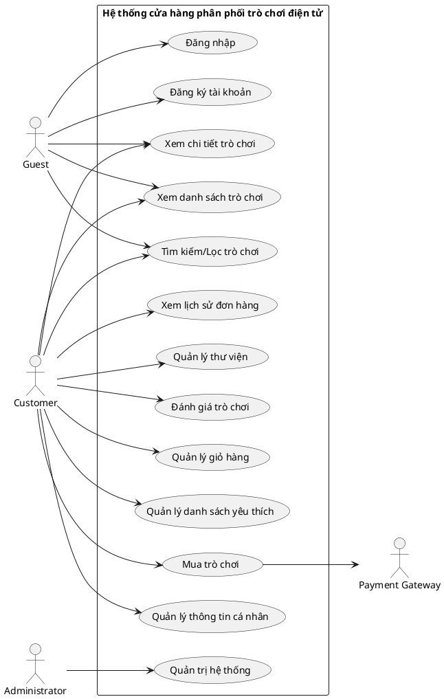

### Hình 1. Biểu đồ Use case tổng quan

## 1.8.2. Các Use case liên quan tới Tài khoản

## 1.8.2.1. Use case Đăng ký, đăng nhập và đăng xuất tài khoản

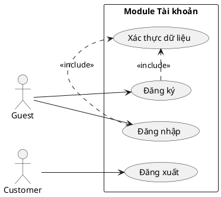

### Hình 2. Biểu đồ Use case Đăng ký, đăng nhập và đăng xuất tài khoản

## 1.8.2.2. Use case Quản lý thông tin cá nhân

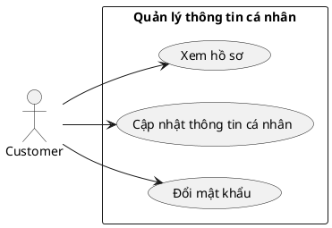

### Hình 3. Biểu đò Use case Quản lý thông tin cá nhân

## 1.8.3. Use case liên quan tới Cửa hàng trò chơi

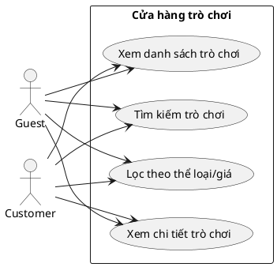

### Hình 4. Biểu đồ use case liên quan tới Cửa hàng trò chơi

## 1.8.4. Use case liên quan tới Giỏ hàng

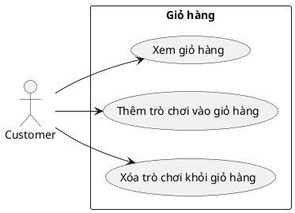

### Hình 5. Biểu đồ use case liên quan tới giỏ hàng

## 1.8.5. Use case liên quan tới Danh sách yêu thích

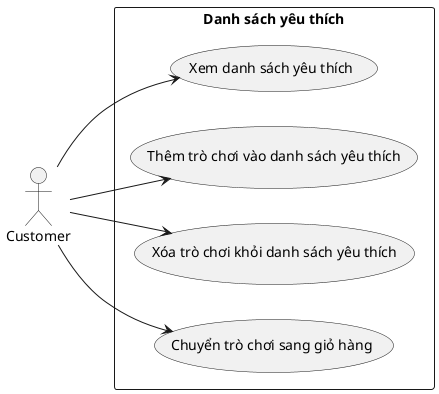

### Hình 6. Biểu đồ use case liên quan tới Danh sách yêu thích

## 1.8.6. Use case liên quan tới Mua hàng và thanh toán

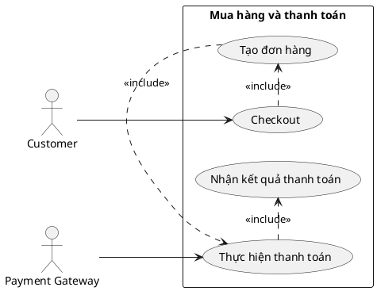

### Hình 7. Biểu đồ use case liên quan tới Mua hàng và thanh toán

## 

## 1.8.7. Use case liên quan tới Đơn hàng và thư viện

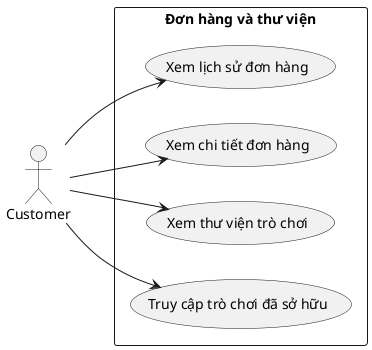

### Hình 8. Biểu đồ use case liên quan tới Đơn hàng và thư viện

## 1.8.8. Use case liên quan tới Đánh giá trò chơi

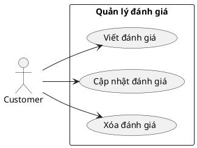

### Hình 9. Biểu đồ use case Quản lý đánh giá

## 1.8.9. Use case liên quan tới Quản trị hệ thống

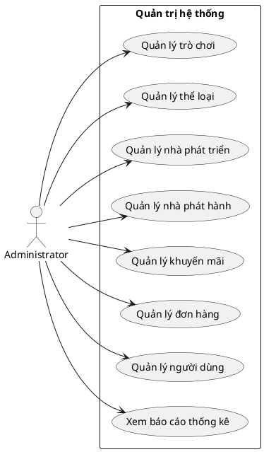

### Hình 10. Biểu đồ use case liên quan tới Quản trị hệ thống

#  

# CHƯƠNG 2: PHƯƠNG PHÁP TIẾP CẬN VÀ GIẢI QUYẾT BÀI TOÁN

## 2.1. Mô hình tổng quát của hệ thống

Từ các yêu cầu nghiệp vụ đã xác định ở Chương 1, hệ thống cửa hàng phân
phối trò chơi điện tử trực tuyến được xây dựng dưới dạng một ứng dụng
web sử dụng Next.js và tổ chức theo kiến trúc Modular Monolith. Toàn bộ
hệ thống vẫn là một ứng dụng thống nhất về mã nguồn và triển khai, nhưng
bên trong được chia thành các module theo miền nghiệp vụ để giảm phụ
thuộc và làm rõ trách nhiệm của từng nhóm chức năng.

Một nguyên tắc quan trọng của kiến trúc là tách biệt Client Side và
Server Side. Client Side đảm nhiệm hiển thị giao diện, tiếp nhận thao
tác và quản lý trạng thái tương tác của người dùng. Server Side đảm
nhiệm xác thực, phân quyền, xử lý quy tắc nghiệp vụ, truy cập cơ sở dữ
liệu, quản lý file media và tích hợp với các hệ thống bên ngoài. Client
không được truy cập trực tiếp Prisma, PostgreSQL hoặc hệ thống file của
máy chủ.

## 2.1.1. Các thành phần chính của hệ thống

Hệ thống gồm các thành phần chính: trình duyệt của người dùng; lớp giao
diện Client Side của Next.js; lớp Server Side của Next.js; các module
nghiệp vụ; Prisma ORM; cơ sở dữ liệu PostgreSQL; vùng lưu trữ media nội
bộ của ứng dụng; và Payment Gateway ở bên ngoài hệ thống. Các thành phần
này phối hợp với nhau thông qua những ranh giới rõ ràng để bảo đảm tính
nhất quán và khả năng bảo trì.

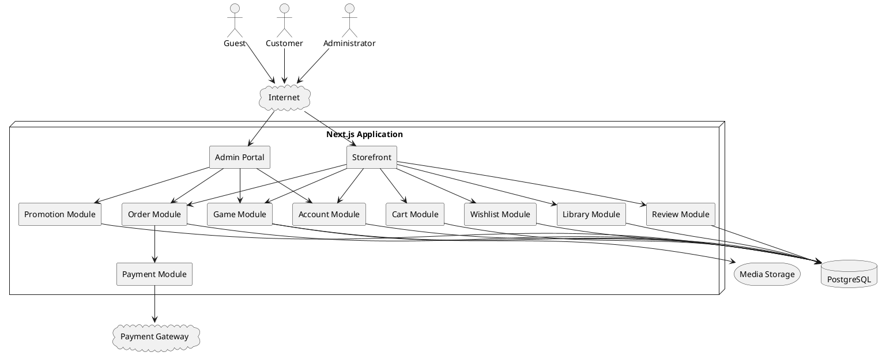

### Hình 11. Mô hình tổng quát của hệ thống

Trong mô hình trên, Client Side chỉ chịu trách nhiệm về giao diện và
tương tác. Các quyết định có ảnh hưởng đến tính đúng đắn của dữ liệu như
kiểm tra quyền sở hữu trò chơi, tính giá hiện hành, xác nhận trạng thái
đơn hàng, cấp quyền sở hữu hoặc phân quyền quản trị đều được xử lý ở
Server Side. Cách tổ chức này giúp tránh việc phụ thuộc vào dữ liệu hoặc
kiểm tra ở phía trình duyệt, đồng thời tạo một ranh giới bảo mật rõ ràng
giữa người dùng và dữ liệu hệ thống.

## 2.1.2. Luồng nghiệp vụ trung tâm

Luồng nghiệp vụ trung tâm của hệ thống vẫn là quá trình mua trò chơi:
User → Cart → Order → Payment → Library Item. Khi khách hàng thực hiện
thanh toán, Server Side phải kiểm tra lại các trò chơi trong giỏ hàng,
trạng thái hiển thị, quyền sở hữu và giá hiện hành trước khi tạo Order
và Order Item. Sau đó Payment Module xử lý hoặc giả lập giao dịch thanh
toán. Chỉ khi thanh toán thành công hệ thống mới cập nhật trạng thái đơn
hàng và tạo Library Item tương ứng.

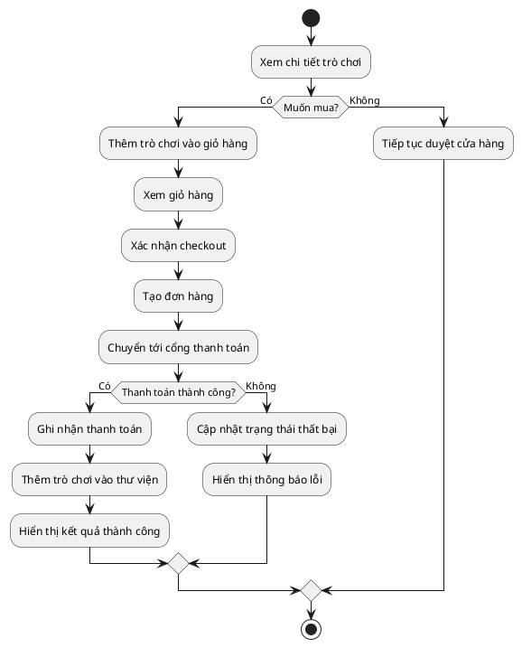

### Hình 12. Luồng tổng quát của nghiệp vụ mua trò chơi

Luồng xử lý này trực tiếp hiện thực các quy tắc nghiệp vụ của Chương 1.
Đặc biệt, giá được kiểm tra lại ở Server Side trước khi tạo đơn hàng, số
tiền thanh toán phải khớp với tổng tiền của Order và quyền sở hữu trò
chơi chỉ được ghi nhận sau khi giao dịch thành công.

## 2.2. Phương pháp xây dựng phần mềm

Đề tài sử dụng phương pháp phân tích và thiết kế hướng đối tượng
(Object-Oriented Analysis and Design -- OOAD). Phương pháp này phù hợp
với bài toán vì hệ thống có nhiều đối tượng nghiệp vụ có thuộc tính,
trạng thái và quan hệ rõ ràng như User, Game, Cart, Wishlist, Order,
Payment, Library Item, Review và Promotion. Các đối tượng đã được xác
định trong Chương 1 là cơ sở để thiết kế cấu trúc dữ liệu và các module
nghiệp vụ trong hệ thống.

Quá trình xây dựng bắt đầu từ actor và use case, sau đó xác định các đối
tượng miền, quan hệ giữa các đối tượng, quy tắc nghiệp vụ và trách nhiệm
của từng module. Ở giai đoạn triển khai, các đối tượng nghiệp vụ được
ánh xạ sang mô hình dữ liệu Prisma và các xử lý liên quan được đặt trong
Server Side. Giao diện phía Client chỉ gọi vào các điểm giao tiếp được
Server Side cung cấp thay vì thao tác trực tiếp với cơ sở dữ liệu.

## 2.2.1. Phân chia hệ thống theo miền nghiệp vụ

Kiến trúc Modular Monolith được tổ chức theo các miền nghiệp vụ chính
gồm Auth/User, Game, Cart, Wishlist, Order, Payment, Library, Review,
Promotion và Admin. Mỗi module đóng gói các xử lý liên quan đến một nhóm
chức năng cụ thể và có ranh giới trách nhiệm riêng. Cách tổ chức này
khác với việc gom toàn bộ service, repository hoặc model của toàn hệ
thống vào các thư mục chung.

Ví dụ, Cart Module chịu trách nhiệm thêm, xóa và kiểm tra trò chơi trong
giỏ; Order Module chịu trách nhiệm tạo và quản lý đơn hàng; Library
Module chịu trách nhiệm quản lý quyền sở hữu; Review Module chịu trách
nhiệm tạo và quản lý đánh giá. Khi một module cần thông tin thuộc miền
khác, việc phối hợp được thực hiện thông qua lớp dịch vụ hoặc giao diện
do module tương ứng cung cấp, thay vì để một module tùy ý thao tác trực
tiếp vào logic nội bộ của module khác.

Việc phân chia theo miền nghiệp vụ giúp mã nguồn phản ánh trực tiếp cấu
trúc bài toán đã phân tích ở Chương 1. Đồng thời, khi một chức năng thay
đổi, phạm vi ảnh hưởng có thể được giới hạn trong module liên quan,
thuận lợi cho kiểm thử, bảo trì và mở rộng.

## 2.3. Mô hình phát triển phần mềm

Đối với phạm vi project, mô hình phát triển lặp và tăng trưởng
(Iterative and Incremental Development) được sử dụng. Thay vì triển khai
toàn bộ hệ thống trong một lần, các chức năng được chia thành từng nhóm
có thể phát triển, tích hợp và kiểm thử qua nhiều vòng lặp. Mỗi vòng lặp
kế thừa kết quả trước đó và bổ sung thêm một phần chức năng hoàn chỉnh.

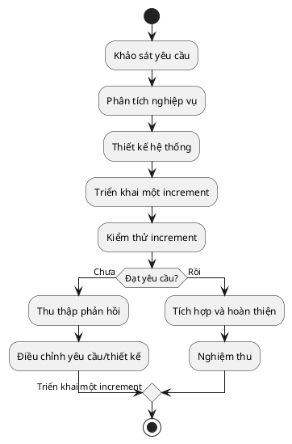

### Hình 13. Quy trình phát triển theo mô hình lặp và tăng trưởng

Vòng lặp đầu tiên tập trung vào nền tảng Next.js, cấu trúc Modular
Monolith, kết nối Prisma với PostgreSQL và chức năng tài khoản. Vòng
tiếp theo triển khai cửa hàng trò chơi, tìm kiếm, lọc và trang chi tiết.
Sau đó hệ thống được bổ sung Cart, Wishlist, Order và Payment; tiếp theo
là Library và Review; cuối cùng là Promotion, các chức năng quản trị,
kiểm thử tích hợp và hoàn thiện giao diện.

Mô hình phát triển này phù hợp với quan hệ phụ thuộc giữa các nghiệp vụ.
Chẳng hạn, Review chỉ có thể kiểm thử đầy đủ sau khi Library đã ghi nhận
đúng quyền sở hữu, còn Payment phụ thuộc vào Cart và Order. Phát triển
theo từng vòng lặp giúp phát hiện lỗi sớm và giảm rủi ro khi tích hợp
toàn bộ hệ thống.

## 2.4. Kiến trúc phần mềm áp dụng trong triển khai hệ thống

## 2.4.1. Kiến trúc Modular Monolith trên Next.js

Hệ thống được triển khai dưới dạng một Modular Monolith. Về mặt vận
hành, hệ thống là một ứng dụng Next.js duy nhất và sử dụng một cơ sở dữ
liệu PostgreSQL. Tuy nhiên, bên trong ứng dụng, mã nguồn được phân chia
theo các module nghiệp vụ độc lập về trách nhiệm. Mỗi module có thể chứa
các thành phần Client Side cần thiết cho giao diện và các thành phần
Server Side cho xử lý nghiệp vụ, nhưng phần xử lý dữ liệu và quy tắc
quan trọng luôn được giới hạn ở phía server.

Việc lựa chọn Modular Monolith phù hợp với quy mô của đề tài hơn kiến
trúc microservices. Hệ thống không cần vận hành nhiều service độc lập,
không phát sinh thêm cơ chế giao tiếp phân tán và vẫn có thể duy trì
ranh giới nghiệp vụ rõ ràng. Khi quy mô tăng trong tương lai, một số
module có thể được tách thành dịch vụ riêng nếu thực sự cần thiết.

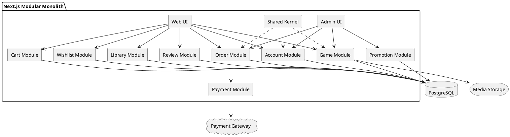

### Hình 14. Kiến trúc Modular Monolith của hệ thống

## 2.4.2. Tách biệt Client Side và Server Side

Next.js cho phép cùng một ứng dụng chứa cả phần giao diện và phần xử lý
phía máy chủ. Trong đề tài, hai phần này được tách biệt về trách nhiệm.
Client Side bao gồm các component cần tương tác trực tiếp với trình
duyệt, xử lý sự kiện, form và trạng thái giao diện. Server Side bao gồm
các thao tác xác thực, phân quyền, truy vấn dữ liệu, xử lý business
rule, transaction, upload file và tích hợp Payment Gateway.

Ranh giới Client--Server được xem là ranh giới bảo mật của hệ thống.
Client có thể thực hiện validation để cải thiện trải nghiệm người dùng
nhưng mọi điều kiện nghiệp vụ quan trọng phải được kiểm tra lại ở Server
Side. Client tuyệt đối không import Prisma Client, không kết nối
PostgreSQL và không trực tiếp ghi file vào vùng lưu trữ media.

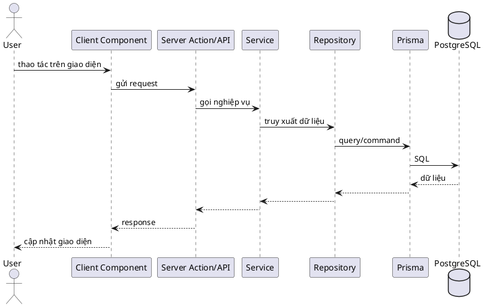

### Hình 15. Luồng xử lý yêu cầu giữa Client Side và Server Side

Ví dụ, khi người dùng yêu cầu thêm một Game vào Cart, Client gửi gameId
đến Server Side. Cart Module kiểm tra người dùng đã đăng nhập hay chưa,
Game có tồn tại và đang được bán hay không, Game đã thuộc thư viện hoặc
đã có trong Cart hay chưa. Chỉ sau khi các điều kiện hợp lệ, thao tác
ghi dữ liệu mới được thực hiện thông qua Prisma.

## 2.4.3. Tổ chức và giao tiếp giữa các module

Mỗi module được thiết kế để quản lý một miền nghiệp vụ cụ thể. Module có
thể chứa service, repository, validator, mapper và các kiểu dữ liệu nội
bộ cần thiết. Những thành phần chỉ sử dụng ở Server Side được đặt trong
vùng server của module để ngăn việc vô tình đưa mã truy cập dữ liệu hoặc
thông tin nhạy cảm xuống trình duyệt.

Các module không nên truy cập tùy ý vào xử lý nội bộ của nhau. Ví dụ,
Review Module cần kiểm tra người dùng có sở hữu Game trước khi tạo đánh
giá. Thay vì tự truy vấn và diễn giải dữ liệu của Library, Review Module
gọi chức năng kiểm tra quyền sở hữu do Library Module cung cấp. Nguyên
tắc này làm giảm coupling và giúp trách nhiệm nghiệp vụ được giữ đúng
tại module sở hữu nó.

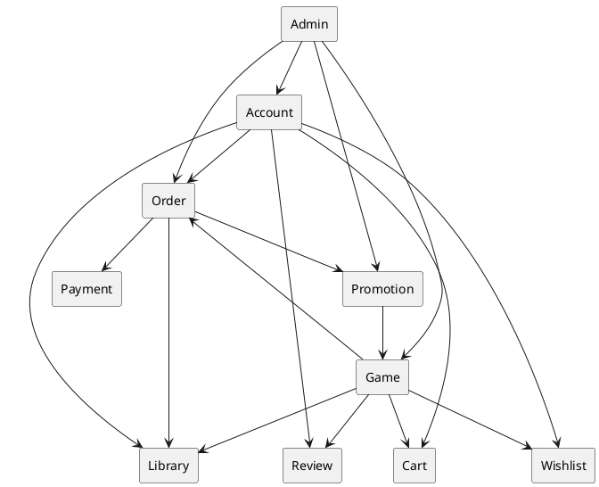

### Hình 16. Quan hệ phối hợp giữa các module nghiệp vụ

## 2.4.4. Tầng truy cập dữ liệu và bảo đảm tính nhất quán

Prisma ORM là thành phần truy cập dữ liệu ở Server Side và là lớp trung
gian giữa các repository với PostgreSQL. Những thao tác CRUD đơn giản có
thể được đóng gói trong repository của từng module, trong khi các quy
tắc nghiệp vụ được đặt ở service. Cách tổ chức này giúp tránh việc giao
diện hoặc các lớp điều phối thao tác trực tiếp với cơ sở dữ liệu.

Đối với nghiệp vụ mua hàng, nhiều dữ liệu liên quan phải được cập nhật
nhất quán, bao gồm Order, Order Item, Payment và Library Item. Các bước
ghi dữ liệu có quan hệ chặt chẽ cần được thực hiện trong transaction phù
hợp. Nếu một bước bắt buộc thất bại, hệ thống phải rollback phần dữ liệu
liên quan để tránh trạng thái đơn hàng đã thành công nhưng quyền sở hữu
chưa được ghi nhận hoặc ngược lại.

## 2.4.5. Quản lý media nội bộ trong ứng dụng

Hệ thống không tích hợp dịch vụ lưu trữ media bên ngoài. Ảnh bìa trò
chơi, banner, screenshot, avatar và các tài nguyên media thuộc phạm vi
hệ thống được lưu trong vùng lưu trữ file của chính ứng dụng hoặc máy
chủ triển khai. PostgreSQL không lưu trực tiếp dữ liệu nhị phân của file
mà chỉ lưu các thông tin tham chiếu như đường dẫn, tên file, loại nội
dung và các metadata cần thiết.

Việc upload và xóa file chỉ được thực hiện ở Server Side thông qua thành
phần quản lý storage. Module nghiệp vụ không thao tác trực tiếp với
filesystem mà gọi một dịch vụ lưu trữ chung. Cách tổ chức này vẫn giữ
được sự tách biệt giữa business logic và hạ tầng lưu trữ, đồng thời cho
phép thay đổi cơ chế lưu trữ trong tương lai mà không phải sửa toàn bộ
các module nghiệp vụ.

```plantuml
@startuml
actor Administrator as Admin
participant "Admin UI" as UI
participant "Game Service" as GS
participant "Media Service" as MS
storage "Media Storage" as Store
database PostgreSQL as DB
Admin -> UI: tải ảnh/video cho trò chơi
UI -> GS: create/update game + media
GS -> MS: validate & save media
MS -> Store: lưu file
Store --> MS: filePath/metadata
MS --> GS: filePath/metadata
GS -> DB: lưu game + media metadata
DB --> GS: kết quả
GS --> UI: thành công
@enduml
```

### Hình 17. Luồng quản lý media nội bộ

Khi triển khai thực tế, vùng lưu trữ media cần được đặt trên filesystem
có khả năng lưu dữ liệu lâu dài. Trong môi trường phát triển hoặc demo,
file có thể được tổ chức trong thư mục media của ứng dụng; khi triển
khai trên máy chủ, thư mục tương ứng cần được cấu hình để dữ liệu không
bị mất khi tiến trình ứng dụng khởi động lại.

## 2.4.6. Xác thực và phân quyền

Xác thực và phân quyền được thực hiện tại Server Side. Guest chỉ được
truy cập các chức năng công khai; Customer được sử dụng các chức năng
tài khoản, Cart, Wishlist, Order, Payment, Library và Review;
Administrator được truy cập các chức năng quản trị. Việc ẩn nút hoặc
trang ở Client Side chỉ phục vụ trải nghiệm giao diện và không được xem
là cơ chế bảo mật.

Mọi request hoặc Server Action truy cập tài nguyên cần bảo vệ phải kiểm
tra phiên đăng nhập và quyền của người dùng trước khi thực hiện nghiệp
vụ. Các thông tin bí mật như chuỗi kết nối cơ sở dữ liệu, thông tin xác
thực và cấu hình server chỉ tồn tại ở phía Server Side.

## 2.5. Lựa chọn công nghệ triển khai hệ thống

Việc lựa chọn công nghệ dựa trên sự phù hợp với kiến trúc Modular
Monolith, khả năng tách biệt Client Side và Server Side, yêu cầu quản lý
dữ liệu quan hệ và phạm vi của project. Bộ công nghệ chính gồm Next.js,
Prisma ORM và PostgreSQL. Media được lưu trực tiếp trong vùng lưu trữ
của ứng dụng thay vì sử dụng dịch vụ lưu trữ bên ngoài.

## 2.5.1. Next.js

Next.js được sử dụng làm framework chính cho ứng dụng web. Framework cho
phép xây dựng cả giao diện và phần xử lý phía server trong cùng một
project, phù hợp với yêu cầu triển khai Modular Monolith. Các trang và
component của cửa hàng, giỏ hàng, thư viện và khu vực quản trị có thể
được tổ chức theo chức năng, trong khi Route Handler hoặc Server Action
tạo điểm giao tiếp từ Client Side đến Server Side.

Việc sử dụng Next.js không đồng nghĩa với việc trộn lẫn toàn bộ mã
client và server. Ngược lại, dự án thiết lập quy tắc rõ ràng về nơi được
phép sử dụng Client Component và nơi chứa logic server-only. Những thao
tác làm việc với Prisma, PostgreSQL, filesystem và Payment Gateway chỉ
được thực hiện tại Server Side.

## 2.5.2. Prisma ORM

Prisma ORM được sử dụng để định nghĩa mô hình dữ liệu và truy cập
PostgreSQL từ Server Side. Các thực thể đã xác định ở Chương 1 như User,
Game, Cart, Wishlist, Order, Payment, Library Item, Review và Promotion
được ánh xạ thành các model và quan hệ phù hợp trong Prisma schema.

Prisma giúp tập trung việc truy cập dữ liệu tại phía server và hỗ trợ
quản lý quan hệ giữa các thực thể. Các module nghiệp vụ sử dụng
repository hoặc data-access function để làm việc với Prisma, tránh để
các component giao diện phụ thuộc trực tiếp vào cách tổ chức dữ liệu
trong cơ sở dữ liệu.

## 2.5.3. PostgreSQL

PostgreSQL được lựa chọn làm hệ quản trị cơ sở dữ liệu vì dữ liệu của
bài toán có cấu trúc quan hệ rõ ràng và yêu cầu tính nhất quán cao. Các
quan hệ một--nhiều, nhiều--nhiều, ràng buộc duy nhất và khóa ngoại được
sử dụng để bảo vệ tính toàn vẹn của các đối tượng nghiệp vụ.

Đặc biệt, các nghiệp vụ liên quan đến Order, Payment và Library yêu cầu
nhiều thay đổi dữ liệu phải được thực hiện nhất quán. Cơ sở dữ liệu quan
hệ kết hợp với transaction ở tầng Server Side phù hợp với yêu cầu này.

## 2.5.4. Lưu trữ media nội bộ

Media được lưu dưới dạng file trên vùng lưu trữ của ứng dụng hoặc
server. Cơ sở dữ liệu chỉ lưu đường dẫn và metadata cần thiết. Giải pháp
này giảm số lượng hệ thống bên ngoài phải tích hợp và phù hợp với phạm
vi thực tập, nơi hệ thống được triển khai với quy mô giới hạn.

Để tránh phụ thuộc trực tiếp vào cấu trúc thư mục, việc lưu, đọc và xóa
file được đóng gói trong Media Storage Service ở Server Side. Các module
như Game hoặc User gọi service này khi cần quản lý ảnh trò chơi hoặc
avatar.

## 2.5.5. Cơ chế giao tiếp giữa Client Side và Server Side

Các thao tác từ giao diện đến server được thực hiện thông qua các cơ chế
do Next.js cung cấp như Route Handler hoặc Server Action tùy loại nghiệp
vụ. Dữ liệu gửi từ Client Side phải được kiểm tra và xác thực lại tại
Server Side trước khi xử lý. Với các điểm giao tiếp dạng HTTP, dữ liệu
có thể được trao đổi ở định dạng JSON và sử dụng mã trạng thái phù hợp
để phản ánh kết quả xử lý.

Việc lựa chọn cơ chế giao tiếp không làm thay đổi nguyên tắc kiến trúc:
Client Side không được truy cập trực tiếp hạ tầng dữ liệu. Mọi luồng từ
trình duyệt đến PostgreSQL hoặc filesystem đều phải đi qua Server Side
và module nghiệp vụ tương ứng.

## 2.5.6. Công cụ hỗ trợ phát triển

Visual Paradigm được sử dụng để xây dựng các mô hình UML phục vụ phân
tích và thiết kế. Git và GitHub hỗ trợ quản lý phiên bản mã nguồn và
theo dõi thay đổi của project. Postman có thể được sử dụng để kiểm thử
các endpoint HTTP khi hệ thống cung cấp Route Handler. Prisma CLI hỗ trợ
quản lý schema và migration của cơ sở dữ liệu trong quá trình phát
triển.

Đối với Payment Gateway, trong phạm vi đề tài có thể sử dụng cơ chế giả
lập hoặc môi trường sandbox để kiểm thử luồng thanh toán mà không phát
sinh giao dịch thực tế.

# CHƯƠNG 3: PHÂN TÍCH, THIẾT KẾ VÀ THỰC NGHIỆM HỆ THỐNG

Chương này áp dụng phương pháp phân tích và thiết kế hướng đối tượng, mô
hình phát triển lặp và kiến trúc Modular Monolith đã lựa chọn ở Chương 2
để chuyển các yêu cầu nghiệp vụ của Chương 1 thành mô hình phân tích,
thiết kế có thể triển khai và kế hoạch kiểm thử. Trong pha phân tích, hệ
thống được xem xét chủ yếu dưới góc độ nghiệp vụ, trách nhiệm và tương
tác giữa tác nhân với hệ thống. Trong pha thiết kế, các mô hình được cụ
thể hóa theo kiến trúc Next.js Modular Monolith, ranh giới Client
Side/Server Side, Prisma ORM, PostgreSQL và vùng lưu trữ media nội bộ.

## 3.1. Phân tích hệ thống

Pha phân tích gồm ba nhóm công việc: mô hình hóa nghiệp vụ dưới dạng
kịch bản; mô hình hóa lớp bằng biểu đồ lớp thực thể và biểu đồ lớp phân
tích của từng module; mô hình hóa động bằng các biểu đồ tuần tự hệ
thống. Mục tiêu của pha này là xác định hệ thống phải thực hiện những
trách nhiệm nào mà chưa phụ thuộc vào chi tiết cài đặt như Prisma, Route
Handler, Server Action hay cấu trúc thư mục của Next.js.

## 3.1.1. Mô hình hóa nghiệp vụ dưới dạng kịch bản

Các use case và quy tắc nghiệp vụ đã xác định ở Chương 1 được chuyển
thành kịch bản để mô tả rõ tiền điều kiện, tác nhân, luồng chính, luồng
thay thế và hậu điều kiện. Những kịch bản có nhiều quy tắc nghiệp vụ
được ưu tiên mô tả chi tiết vì chúng là cơ sở để xây dựng mô hình lớp,
mô hình động và ca kiểm thử ở các phần sau.

## 3.1.1.1. Kịch bản đăng nhập

+--------------+-------------------------------------------------------+
| Tên use-case | Đăng nhập                                             |
+==============+=======================================================+
| Actor        | Guest                                                 |
+--------------+-------------------------------------------------------+
| Tiền điều    | Người dùng đã có tài khoản trong hệ thống.            |
| kiện         |                                                       |
+--------------+-------------------------------------------------------+
| Hậu điều     | Nếu thành công, phiên đăng nhập được thiết lập và     |
| kiện         | người dùng được cấp quyền theo vai trò; nếu thất bại, |
|              | hệ thống không tạo phiên đăng nhập.                   |
+--------------+-------------------------------------------------------+
| Luồng chính  | 1\. Guest nhập email hoặc tên đăng nhập và mật khẩu.  |
|              |                                                       |
|              | 2\. Hệ thống kiểm tra dữ liệu đăng nhập.              |
|              |                                                       |
|              | 3\. Hệ thống tìm tài khoản tương ứng.                 |
|              |                                                       |
|              | 4\. Hệ thống kiểm tra trạng thái tài khoản.           |
|              |                                                       |
|              | 5\. Hệ thống xác thực mật khẩu.                       |
|              |                                                       |
|              | 6\. Hệ thống thiết lập phiên đăng nhập.               |
|              |                                                       |
|              | 7\. Hệ thống chuyển người dùng đến khu vực phù hợp    |
|              | với vai trò.                                          |
+--------------+-------------------------------------------------------+
| Luồng ngoại  | 2a. Dữ liệu đăng nhập thiếu hoặc không hợp lệ: hệ     |
| lệ           | thống thông báo lỗi và dừng xử lý.                    |
|              |                                                       |
|              | 3a. Không tìm thấy tài khoản: hệ thống thông báo      |
|              | thông tin đăng nhập không đúng và dừng xử lý.         |
|              |                                                       |
|              | 4a. Tài khoản bị khóa: hệ thống từ chối đăng nhập và  |
|              | dừng xử lý.                                           |
|              |                                                       |
|              | 5a. Mật khẩu không đúng: hệ thống thông báo lỗi và    |
|              | dừng xử lý.                                           |
+--------------+-------------------------------------------------------+

## 3.1.1.2. Kịch bản thêm trò chơi vào giỏ hàng

+--------------+-------------------------------------------------------+
| Tên use-case | Thêm trò chơi vào giỏ hàng                            |
+==============+=======================================================+
| Actor        | Customer                                              |
+--------------+-------------------------------------------------------+
| Tiền điều    | Customer đã đăng nhập và gửi yêu cầu thêm một trò     |
| kiện         | chơi vào giỏ hàng.                                    |
+--------------+-------------------------------------------------------+
| Hậu điều     | Nếu thành công, một Cart Item tương ứng được tạo      |
| kiện         | trong giỏ hàng và không phát sinh bản ghi trùng; nếu  |
|              | thất bại, giỏ hàng không thay đổi.                    |
+--------------+-------------------------------------------------------+
| Luồng chính  | 1\. Customer chọn một trò chơi và yêu cầu thêm vào    |
|              | giỏ hàng.                                             |
|              |                                                       |
|              | 2\. Hệ thống kiểm tra trò chơi tồn tại và đang được   |
|              | hiển thị.                                             |
|              |                                                       |
|              | 3\. Hệ thống kiểm tra Customer chưa sở hữu trò chơi   |
|              | trong Library.                                        |
|              |                                                       |
|              | 4\. Hệ thống kiểm tra trò chơi chưa tồn tại trong     |
|              | Cart hiện tại.                                        |
|              |                                                       |
|              | 5\. Hệ thống tạo Cart Item cho trò chơi.              |
|              |                                                       |
|              | 6\. Hệ thống trả về giỏ hàng đã được cập nhật.        |
+--------------+-------------------------------------------------------+
| Luồng ngoại  | 2a. Trò chơi không tồn tại hoặc đã bị ẩn: hệ thống từ |
| lệ           | chối thêm vào giỏ hàng.                               |
|              |                                                       |
|              | 3a. Customer đã sở hữu trò chơi: hệ thống từ chối     |
|              | thêm vào giỏ hàng.                                    |
|              |                                                       |
|              | 4a. Trò chơi đã có trong Cart: hệ thống không tạo     |
|              | Cart Item mới.                                        |
+--------------+-------------------------------------------------------+

## 3.1.1.3. Kịch bản thanh toán và mua trò chơi

+--------------+-------------------------------------------------------+
| Tên use-case | Thanh toán và mua trò chơi                            |
+==============+=======================================================+
| Actor        | Customer (chính); Payment Gateway (phụ)               |
+--------------+-------------------------------------------------------+
| Tiền điều    | Customer đã đăng nhập và có Cart hoạt động.           |
| kiện         |                                                       |
+--------------+-------------------------------------------------------+
| Hậu điều     | Nếu thanh toán thành công, Order và Payment được cập  |
| kiện         | nhật, Library Item được tạo cho các trò chơi đã mua   |
|              | và các mục tương ứng được xóa khỏi Cart. Nếu thanh    |
|              | toán thất bại, không tạo Library Item và Order không  |
|              | được đánh dấu đã thanh toán.                          |
+--------------+-------------------------------------------------------+
| Luồng chính  | 1\. Customer mở giỏ hàng và xác nhận checkout.        |
|              |                                                       |
|              | 2\. Hệ thống đọc giỏ hàng và kiểm tra có ít nhất một  |
|              | mục cần thanh toán.                                   |
|              |                                                       |
|              | 3\. Server Side kiểm tra lại từng trò chơi: trạng     |
|              | thái hiển thị, quyền sở hữu, giá hiện hành và chương  |
|              | trình khuyến mãi.                                     |
|              |                                                       |
|              | 4\. Order Module tạo Order và Order Item theo giá đã  |
|              | được xác nhận, với trạng thái chờ thanh toán.         |
|              |                                                       |
|              | 5\. Payment Module khởi tạo Payment ở trạng thái chờ  |
|              | xử lý.                                                |
|              |                                                       |
|              | 6\. Payment Module gửi yêu cầu thanh toán tới Payment |
|              | Gateway thông qua adapter thanh toán.                 |
|              |                                                       |
|              | 7\. Payment Gateway trả kết quả giao dịch.            |
|              |                                                       |
|              | 8\. Khi giao dịch thành công, hệ thống thực hiện      |
|              | transaction cục bộ để cập nhật Payment, Order và tạo  |
|              | Library Item.                                         |
|              |                                                       |
|              | 9\. Hệ thống xóa các Cart Item đã mua.                |
|              |                                                       |
|              | 10\. Hệ thống trả kết quả thanh toán thành công cho   |
|              | Customer.                                             |
+--------------+-------------------------------------------------------+
| Luồng ngoại  | 2a. Giỏ hàng rỗng: hệ thống dừng checkout và thông    |
| lệ           | báo cho Customer.                                     |
|              |                                                       |
|              | 3a. Có trò chơi không còn hợp lệ, đã bị ẩn hoặc đã    |
|              | thuộc Library: hệ thống dừng checkout và yêu cầu cập  |
|              | nhật giỏ hàng.                                        |
|              |                                                       |
|              | 7a. Payment Gateway trả kết quả thất bại: hệ thống    |
|              | ghi nhận Payment thất bại, không đánh dấu Order đã    |
|              | thanh toán và không tạo Library Item.                 |
|              |                                                       |
|              | 8a. Transaction cập nhật dữ liệu cục bộ thất bại: hệ  |
|              | thống rollback các thay đổi trong transaction, không  |
|              | cấp quyền sở hữu và ghi nhận trạng thái cần xử lý     |
|              | lại.                                                  |
+--------------+-------------------------------------------------------+

## 3.1.1.4. Kịch bản đánh giá trò chơi

+--------------+-------------------------------------------------------+
| Tên use-case | Đánh giá trò chơi                                     |
+==============+=======================================================+
| Actor        | Customer                                              |
+--------------+-------------------------------------------------------+
| Tiền điều    | Customer đã đăng nhập; trò chơi tồn tại trong hệ      |
| kiện         | thống.                                                |
+--------------+-------------------------------------------------------+
| Hậu điều     | Nếu thành công, Review được tạo và mỗi Customer chỉ   |
| kiện         | có tối đa một Review cho mỗi Game; nếu thất bại,      |
|              | không tạo Review mới.                                 |
+--------------+-------------------------------------------------------+
| Luồng chính  | 1\. Customer mở trang trò chơi và gửi nội dung đánh   |
|              | giá.                                                  |
|              |                                                       |
|              | 2\. Hệ thống kiểm tra quyền sở hữu trò chơi thông qua |
|              | Library.                                              |
|              |                                                       |
|              | 3\. Hệ thống kiểm tra Customer chưa có Review cho trò |
|              | chơi.                                                 |
|              |                                                       |
|              | 4\. Hệ thống kiểm tra nội dung đánh giá hợp lệ.       |
|              |                                                       |
|              | 5\. Hệ thống tạo Review.                              |
|              |                                                       |
|              | 6\. Hệ thống trả kết quả thành công và hiển thị       |
|              | Review nếu trạng thái cho phép.                       |
+--------------+-------------------------------------------------------+
| Luồng ngoại  | 2a. Customer chưa sở hữu trò chơi: hệ thống từ chối   |
| lệ           | tạo Review.                                           |
|              |                                                       |
|              | 3a. Customer đã có Review cho trò chơi: hệ thống từ   |
|              | chối tạo Review mới.                                  |
|              |                                                       |
|              | 4a. Nội dung đánh giá không hợp lệ: hệ thống thông    |
|              | báo lỗi và không lưu Review.                          |
+--------------+-------------------------------------------------------+

## 3.1.1.5. Kịch bản quản trị trò chơi

+--------------+-------------------------------------------------------+
| Tên use-case | Quản trị trò chơi                                     |
+==============+=======================================================+
| Actor        | Administrator                                         |
+--------------+-------------------------------------------------------+
| Tiền điều    | Người dùng đã đăng nhập và gửi yêu cầu tới chức năng  |
| kiện         | quản trị trò chơi.                                    |
+--------------+-------------------------------------------------------+
| Hậu điều     | Nếu thành công, dữ liệu Game và các quan hệ liên quan |
| kiện         | được cập nhật nhất quán; media hợp lệ được lưu thông  |
|              | qua Media Storage Service và metadata tương ứng được  |
|              | ghi nhận. Nếu thất bại, thay đổi không hợp lệ không   |
|              | được ghi nhận.                                        |
+--------------+-------------------------------------------------------+
| Luồng chính  | 1\. Administrator mở chức năng quản lý trò chơi và    |
|              | chọn tạo mới hoặc chỉnh sửa Game.                     |
|              |                                                       |
|              | 2\. Server Side kiểm tra quyền Administrator.         |
|              |                                                       |
|              | 3\. Hệ thống kiểm tra dữ liệu Game, bao gồm giá,      |
|              | Category, Developer và Publisher.                     |
|              |                                                       |
|              | 4\. Nếu có media, hệ thống kiểm tra và lưu file thông |
|              | qua Media Storage Service.                            |
|              |                                                       |
|              | 5\. Hệ thống lưu Game, các quan hệ và metadata media  |
|              | cần thiết thông qua Prisma/PostgreSQL, sử dụng        |
|              | transaction khi có nhiều thao tác ghi liên quan.      |
|              |                                                       |
|              | 6\. Hệ thống trả kết quả thành công cho               |
|              | Administrator.                                        |
+--------------+-------------------------------------------------------+
| Luồng ngoại  | 2a. Người dùng không có quyền Administrator: hệ thống |
| lệ           | từ chối thao tác.                                     |
|              |                                                       |
|              | 3a. Dữ liệu Game không hợp lệ, bao gồm giá âm hoặc    |
|              | quan hệ không hợp lệ: hệ thống thông báo lỗi và không |
|              | lưu dữ liệu.                                          |
|              |                                                       |
|              | 4a. File media không hợp lệ: hệ thống từ chối file và |
|              | không tạo metadata tương ứng.                         |
|              |                                                       |
|              | 5a. Thao tác ghi dữ liệu thất bại: hệ thống rollback  |
|              | các thay đổi thuộc transaction; nếu file media mới đã |
|              | được lưu nhưng metadata chưa được ghi nhận, hệ thống  |
|              | xóa file phát sinh để tránh dữ liệu mồ côi, sau đó    |
|              | trả thông báo lỗi.                                    |
+--------------+-------------------------------------------------------+

Ngoài năm kịch bản trọng tâm trên, các nghiệp vụ quản lý Wishlist, xem
lịch sử đơn hàng, quản lý thư viện, quản lý khuyến mãi, quản lý người
dùng và báo cáo thống kê được phân tích theo cùng một cấu trúc. Các kịch
bản này kế thừa trực tiếp actor, use case và quy tắc nghiệp vụ đã mô tả
ở Chương 1.

## 3.1.2. Mô hình hóa lớp

## 3.1.2.1. Biểu đồ lớp thực thể tổng thể

Ở mức phân tích, biểu đồ lớp thực thể mô tả các đối tượng nghiệp vụ
chính và quan hệ giữa chúng. Biểu đồ chưa đưa vào các lớp kỹ thuật như
repository, Prisma Client hay thành phần của Next.js.

```plantuml
@startuml
skinparam classAttributeIconSize 0
class User {+id
+username
+email
+role
+status}
class Game {+id
+title
+price
+isPublished}
class Category {+id
+name}
class Developer {+id
+name}
class Publisher {+id
+name}
class GameMedia {+id
+type
+path}
class Cart {+id
+userId}
class CartItem {+id
+cartId
+gameId}
class Wishlist {+id
+userId}
class WishlistItem {+id
+wishlistId
+gameId}
class Order {+id
+userId
+status
+totalAmount}
class OrderItem {+id
+orderId
+gameId
+unitPrice}
class Payment {+id
+orderId
+status
+transactionCode}
class LibraryItem {+id
+userId
+gameId}
class Review {+id
+userId
+gameId
+rating}
class Promotion {+id
+name
+discountType
+discountValue}
class GamePromotion {+gameId
+promotionId}
User "1" -- "1" Cart
Cart "1" -- "0..*" CartItem
Game "1" -- "0..*" CartItem
User "1" -- "1" Wishlist
Wishlist "1" -- "0..*" WishlistItem
Game "1" -- "0..*" WishlistItem
User "1" -- "0..*" Order
Order "1" -- "1..*" OrderItem
Game "1" -- "0..*" OrderItem
Order "1" -- "0..1" Payment
User "1" -- "0..*" LibraryItem
Game "1" -- "0..*" LibraryItem
OrderItem "1" -- "0..1" LibraryItem
User "1" -- "0..*" Review
Game "1" -- "0..*" Review
Game "*" -- "*" Category
Developer "1" -- "0..*" Game
Publisher "1" -- "0..*" Game
Game "1" -- "0..*" GameMedia
Promotion "1" -- "0..*" GamePromotion
Game "1" -- "0..*" GamePromotion
@enduml
```

### Hình 18. Biểu đồ lớp thực thể tổng thể của hệ thống

## 3.1.2.2. Biểu đồ lớp phân tích module Tài khoản

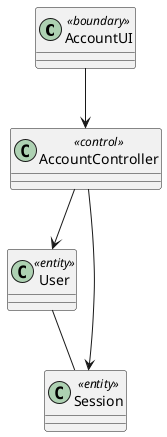

### Hình 19. Biểu đồ lớp phân tích module Tài khoản

## 3.1.2.3. Biểu đồ lớp phân tích module Trò chơi

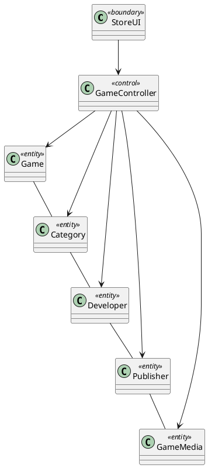

### Hình 20. Biểu đồ lớp phân tích module Trò chơi

## 3.1.2.4. Biểu đồ lớp phân tích module Giỏ hàng

```plantuml
@startuml
skinparam classAttributeIconSize 0
class CartUI <<boundary>>
class CartController <<control>>
class Cart <<entity>>
class CartItem <<entity>>
class Game <<entity>>
CartUI --> CartController
CartController --> Cart
CartController --> CartItem
CartController --> Game
Cart -- CartItem
CartItem -- Game
@enduml
```

### Hình 21. Biểu đồ lớp phân tích module Giỏ hàng

## 3.1.2.5. Biểu đồ lớp phân tích module Danh sách yêu thích

```plantuml
@startuml
skinparam classAttributeIconSize 0
class WishlistUI <<boundary>>
class WishlistController <<control>>
class Wishlist <<entity>>
class WishlistItem <<entity>>
class Game <<entity>>
WishlistUI --> WishlistController
WishlistController --> Wishlist
WishlistController --> WishlistItem
WishlistController --> Game
Wishlist -- WishlistItem
WishlistItem -- Game
@enduml
```

### Hình 22. Biểu đồ lớp phân tích module Danh sách yêu thích

## 3.1.2.6. Biểu đồ lớp phân tích module Đơn hàng

```plantuml
@startuml
skinparam classAttributeIconSize 0
class CheckoutUI <<boundary>>
class OrderController <<control>>
class Order <<entity>>
class OrderItem <<entity>>
class Payment <<entity>>
CheckoutUI --> OrderController
OrderController --> Order
OrderController --> OrderItem
OrderController --> Payment
Order -- OrderItem
OrderItem -- Payment
@enduml
```

### Hình 23. Biểu đồ lớp phân tích module Đơn hàng

## 3.1.2.7. Biểu đồ lớp phân tích module Thanh toán

```plantuml
@startuml
skinparam classAttributeIconSize 0
class PaymentUI <<boundary>>
class PaymentController <<control>>
class Payment <<entity>>
class Order <<entity>>
class PaymentGateway <<entity>>
PaymentUI --> PaymentController
PaymentController --> Payment
PaymentController --> Order
PaymentController --> PaymentGateway
Payment -- Order
Order -- PaymentGateway
@enduml
```

### Hình 24. Biểu đồ lớp phân tích module Thanh toán

## 3.1.2.8. Biểu đồ lớp phân tích module Thư viện

```plantuml
@startuml
skinparam classAttributeIconSize 0
class LibraryUI <<boundary>>
class LibraryController <<control>>
class LibraryItem <<entity>>
class Game <<entity>>
class User <<entity>>
LibraryUI --> LibraryController
LibraryController --> LibraryItem
LibraryController --> Game
LibraryController --> User
LibraryItem -- Game
Game -- User
@enduml
```

### Hình 25. Biểu đồ lớp phân tích module Thư viện

## 3.1.2.9. Biểu đồ lớp phân tích module Đánh giá

```plantuml
@startuml
skinparam classAttributeIconSize 0
class ReviewUI <<boundary>>
class ReviewController <<control>>
class Review <<entity>>
class Game <<entity>>
class User <<entity>>
ReviewUI --> ReviewController
ReviewController --> Review
ReviewController --> Game
ReviewController --> User
Review -- Game
Game -- User
@enduml
```

### Hình 26. Biểu đồ lớp phân tích module Đánh giá

## 3.1.2.10. Biểu đồ lớp phân tích module Khuyến mãi

```plantuml
@startuml
skinparam classAttributeIconSize 0
class PromotionUI <<boundary>>
class PromotionController <<control>>
class Promotion <<entity>>
class GamePromotion <<entity>>
class Game <<entity>>
PromotionUI --> PromotionController
PromotionController --> Promotion
PromotionController --> GamePromotion
PromotionController --> Game
Promotion -- GamePromotion
GamePromotion -- Game
@enduml
```

### Hình 27. Biểu đồ lớp phân tích module Khuyến mãi

## 3.1.2.11. Biểu đồ lớp phân tích module Quản trị

```plantuml
@startuml
skinparam classAttributeIconSize 0
class AdminUI <<boundary>>
class AdminController <<control>>
class Game <<entity>>
class Category <<entity>>
class Developer <<entity>>
class Publisher <<entity>>
class Promotion <<entity>>
class Order <<entity>>
class User <<entity>>
AdminUI --> AdminController
AdminController --> Game
AdminController --> Category
AdminController --> Developer
AdminController --> Publisher
AdminController --> Promotion
AdminController --> Order
AdminController --> User
Game -- Category
Category -- Developer
Developer -- Publisher
Publisher -- Promotion
Promotion -- Order
Order -- User
@enduml
```

### Hình 28. Biểu đồ lớp phân tích module Quản trị

## 3.1.3. Mô hình hóa động

Ở pha phân tích, mô hình động tập trung vào tương tác giữa tác nhân và
toàn bộ hệ thống như một hộp đen. Các biểu đồ tuần tự hệ thống chưa thể
hiện service, repository, Prisma hay PostgreSQL. Những thành phần kỹ
thuật này chỉ xuất hiện ở pha thiết kế. Ở bản Markdown này, các biểu đồ
tuần tự hệ thống đã được bổ sung đầy đủ cho toàn bộ các use-case chính và
các use-case quản trị.

## 3.1.3.1. Biểu đồ tuần tự hệ thống cho đăng ký tài khoản

```plantuml
@startuml
actor Guest
participant "Hệ thống" as System
Guest -> System: mở biểu mẫu đăng ký
Guest -> System: gửi thông tin đăng ký
System --> Guest: thông báo kết quả đăng ký
@enduml
```

## 3.1.3.2. Biểu đồ tuần tự hệ thống cho đăng nhập

```plantuml
@startuml
actor Guest
participant "Hệ thống" as System
Guest -> System: nhập tên đăng nhập/email và mật khẩu
System --> Guest: trả về kết quả đăng nhập / phiên làm việc
@enduml
```

## 3.1.3.3. Biểu đồ tuần tự hệ thống cho đăng xuất

```plantuml
@startuml
actor Customer
participant "Hệ thống" as System
Customer -> System: yêu cầu đăng xuất
System --> Customer: hủy phiên và chuyển về trạng thái khách
@enduml
```

## 3.1.3.4. Biểu đồ tuần tự hệ thống cho xem danh sách trò chơi

```plantuml
@startuml
actor User
participant "Hệ thống" as System
User -> System: yêu cầu xem danh sách trò chơi
System --> User: trả về danh sách trò chơi
@enduml
```

## 3.1.3.5. Biểu đồ tuần tự hệ thống cho tìm kiếm và lọc trò chơi

```plantuml
@startuml
actor User
participant "Hệ thống" as System
User -> System: nhập từ khóa / bộ lọc
System --> User: trả về kết quả phù hợp
@enduml
```

## 3.1.3.6. Biểu đồ tuần tự hệ thống cho xem thông tin chi tiết trò chơi

```plantuml
@startuml
actor User
participant "Hệ thống" as System
User -> System: yêu cầu xem chi tiết trò chơi
System --> User: hiển thị thông tin, media, giá và đánh giá
@enduml
```

## 3.1.3.7. Biểu đồ tuần tự hệ thống cho thêm trò chơi vào giỏ hàng

```plantuml
@startuml
actor Customer
participant "Hệ thống" as System
Customer -> System: thêm trò chơi vào giỏ hàng
System --> Customer: cập nhật giỏ hàng
@enduml
```

## 3.1.3.8. Biểu đồ tuần tự hệ thống cho xóa trò chơi khỏi giỏ hàng

```plantuml
@startuml
actor Customer
participant "Hệ thống" as System
Customer -> System: xóa trò chơi khỏi giỏ hàng
System --> Customer: cập nhật giỏ hàng
@enduml
```

## 3.1.3.9. Biểu đồ tuần tự hệ thống cho thêm trò chơi vào danh sách yêu thích

```plantuml
@startuml
actor Customer
participant "Hệ thống" as System
Customer -> System: thêm trò chơi vào danh sách yêu thích
System --> Customer: cập nhật danh sách yêu thích
@enduml
```

## 3.1.3.10. Biểu đồ tuần tự hệ thống cho xóa trò chơi khỏi danh sách yêu thích

```plantuml
@startuml
actor Customer
participant "Hệ thống" as System
Customer -> System: xóa trò chơi khỏi danh sách yêu thích
System --> Customer: cập nhật danh sách yêu thích
@enduml
```

## 3.1.3.11. Biểu đồ tuần tự hệ thống cho mua trò chơi

```plantuml
@startuml
actor Customer
participant "Hệ thống" as System
participant "Payment Gateway" as PG
Customer -> System: xác nhận mua hàng
System -> PG: tạo giao dịch thanh toán
PG --> System: trả kết quả thanh toán
System --> Customer: thông báo kết quả và cập nhật thư viện
@enduml
```

## 3.1.3.12. Biểu đồ tuần tự hệ thống cho xem lịch sử đơn hàng

```plantuml
@startuml
actor Customer
participant "Hệ thống" as System
Customer -> System: yêu cầu xem lịch sử đơn hàng
System --> Customer: trả về danh sách đơn hàng
@enduml
```

## 3.1.3.13. Biểu đồ tuần tự hệ thống cho quản lý thư viện trò chơi

```plantuml
@startuml
actor Customer
participant "Hệ thống" as System
Customer -> System: yêu cầu xem thư viện
System --> Customer: trả về danh sách trò chơi đã sở hữu
@enduml
```

## 3.1.3.14. Biểu đồ tuần tự hệ thống cho đánh giá trò chơi

```plantuml
@startuml
actor Customer
participant "Hệ thống" as System
Customer -> System: gửi nội dung đánh giá và số sao
System --> Customer: thông báo kết quả lưu đánh giá
@enduml
```

## 3.1.3.15. Biểu đồ tuần tự hệ thống cho quản lý thông tin cá nhân

```plantuml
@startuml
actor Customer
participant "Hệ thống" as System
Customer -> System: xem/cập nhật thông tin cá nhân
System --> Customer: trả về hồ sơ đã cập nhật
@enduml
```

## 3.1.3.16. Biểu đồ tuần tự hệ thống cho quản lý trò chơi

```plantuml
@startuml
actor Administrator as Admin
participant "Hệ thống" as System
Admin -> System: tạo/cập nhật/xóa trò chơi
System --> Admin: thông báo kết quả xử lý
@enduml
```

## 3.1.3.17. Biểu đồ tuần tự hệ thống cho quản lý thể loại

```plantuml
@startuml
actor Administrator as Admin
participant "Hệ thống" as System
Admin -> System: tạo/cập nhật/xóa thể loại
System --> Admin: thông báo kết quả xử lý
@enduml
```

## 3.1.3.18. Biểu đồ tuần tự hệ thống cho quản lý nhà phát triển và nhà phát hành

```plantuml
@startuml
actor Administrator as Admin
participant "Hệ thống" as System
Admin -> System: quản lý nhà phát triển / nhà phát hành
System --> Admin: trả về kết quả xử lý
@enduml
```

## 3.1.3.19. Biểu đồ tuần tự hệ thống cho quản lý chương trình khuyến mãi

```plantuml
@startuml
actor Administrator as Admin
participant "Hệ thống" as System
Admin -> System: tạo/cập nhật/xóa khuyến mãi
System --> Admin: thông báo kết quả xử lý
@enduml
```

## 3.1.3.20. Biểu đồ tuần tự hệ thống cho quản lý đơn hàng

```plantuml
@startuml
actor Administrator as Admin
participant "Hệ thống" as System
Admin -> System: xem/cập nhật trạng thái đơn hàng
System --> Admin: trả về kết quả xử lý
@enduml
```

## 3.1.3.21. Biểu đồ tuần tự hệ thống cho quản lý người dùng

```plantuml
@startuml
actor Administrator as Admin
participant "Hệ thống" as System
Admin -> System: xem/cập nhật trạng thái người dùng
System --> Admin: trả về kết quả xử lý
@enduml
```

## 3.2. Thiết kế hệ thống

Pha thiết kế cụ thể hóa các kết quả phân tích thành cấu trúc có thể
triển khai. Ở pha này, mô hình thể hiện rõ các thuộc tính lưu trữ, cơ sở
dữ liệu PostgreSQL, Prisma ORM, ranh giới Client Side/Server Side,
service, repository, giao tiếp liên module và tích hợp hạ tầng.

## 3.2.1. Thiết kế biểu đồ lớp thực thể

Biểu đồ lớp thực thể ở mức thiết kế bổ sung khóa định danh, thuộc tính
lưu trữ và các ràng buộc quan trọng. Các kiểu dữ liệu trong biểu đồ mang
tính logic; kiểu PostgreSQL và ánh xạ chi tiết được thể hiện trong
Prisma schema khi triển khai.

```plantuml
@startuml
skinparam classAttributeIconSize 0
class User {+id
+username
+email
+role
+status}
class Game {+id
+title
+price
+isPublished}
class Category {+id
+name}
class Developer {+id
+name}
class Publisher {+id
+name}
class GameMedia {+id
+type
+path}
class Cart {+id
+userId}
class CartItem {+id
+cartId
+gameId}
class Wishlist {+id
+userId}
class WishlistItem {+id
+wishlistId
+gameId}
class Order {+id
+userId
+status
+totalAmount}
class OrderItem {+id
+orderId
+gameId
+unitPrice}
class Payment {+id
+orderId
+status
+transactionCode}
class LibraryItem {+id
+userId
+gameId}
class Review {+id
+userId
+gameId
+rating}
class Promotion {+id
+name
+discountType
+discountValue}
class GamePromotion {+gameId
+promotionId}
User "1" -- "1" Cart
Cart "1" -- "0..*" CartItem
Game "1" -- "0..*" CartItem
User "1" -- "1" Wishlist
Wishlist "1" -- "0..*" WishlistItem
Game "1" -- "0..*" WishlistItem
User "1" -- "0..*" Order
Order "1" -- "1..*" OrderItem
Game "1" -- "0..*" OrderItem
Order "1" -- "0..1" Payment
User "1" -- "0..*" LibraryItem
Game "1" -- "0..*" LibraryItem
OrderItem "1" -- "0..1" LibraryItem
User "1" -- "0..*" Review
Game "1" -- "0..*" Review
Game "*" -- "*" Category
Developer "1" -- "0..*" Game
Publisher "1" -- "0..*" Game
Game "1" -- "0..*" GameMedia
Promotion "1" -- "0..*" GamePromotion
Game "1" -- "0..*" GamePromotion
@enduml
```

### Hình 33. Biểu đồ lớp thực thể ở mức thiết kế

## 3.2.2. Thiết kế cơ sở dữ liệu

Cơ sở dữ liệu sử dụng PostgreSQL và được truy cập từ Server Side thông
qua Prisma ORM. Các bảng được thiết kế từ mô hình thực thể, đồng thời bổ
sung khóa chính, khóa ngoại, ràng buộc duy nhất và các trường snapshot
cần thiết cho lịch sử giao dịch. Các ràng buộc quan trọng gồm username
và email duy nhất; một Game chỉ xuất hiện một lần trong cùng một Cart;
một Game chỉ xuất hiện một lần trong cùng một Wishlist; mỗi User chỉ có
một Library Item cho cùng một Game; mỗi User chỉ có một Review cho cùng
một Game.

```plantuml
@startuml
entity users { *id : uuid
--
username : varchar
email : varchar
password_hash : varchar
role : enum
status : enum }
entity games { *id : uuid
--
title : varchar
price : decimal
developer_id : uuid
publisher_id : uuid }
entity categories { *id : uuid
--
name : varchar }
entity game_categories { *game_id : uuid
*category_id : uuid }
entity developers { *id : uuid
--
name : varchar }
entity publishers { *id : uuid
--
name : varchar }
entity game_media { *id : uuid
--
game_id : uuid
path : varchar
type : varchar }
entity carts { *id : uuid
--
user_id : uuid }
entity cart_items { *id : uuid
--
cart_id : uuid
game_id : uuid }
entity wishlists { *id : uuid
--
user_id : uuid }
entity wishlist_items { *id : uuid
--
wishlist_id : uuid
game_id : uuid }
entity orders { *id : uuid
--
user_id : uuid
status : varchar
total_amount : decimal }
entity order_items { *id : uuid
--
order_id : uuid
game_id : uuid
unit_price : decimal }
entity payments { *id : uuid
--
order_id : uuid
status : varchar
provider_ref : varchar }
entity library_items { *id : uuid
--
user_id : uuid
game_id : uuid
order_item_id : uuid }
entity reviews { *id : uuid
--
user_id : uuid
game_id : uuid
rating : int }
entity promotions { *id : uuid
--
name : varchar
discount_type : varchar
discount_value : decimal }
entity game_promotions { *game_id : uuid
*promotion_id : uuid }
users ||--|| carts
users ||--|| wishlists
users ||--o{ orders
users ||--o{ library_items
users ||--o{ reviews
games ||--o{ cart_items
games ||--o{ wishlist_items
games ||--o{ order_items
games ||--o{ library_items
games ||--o{ reviews
games ||--o{ game_media
developers ||--o{ games
publishers ||--o{ games
carts ||--o{ cart_items
wishlists ||--o{ wishlist_items
orders ||--o{ order_items
orders ||--o| payments
order_items ||--o| library_items
categories ||--o{ game_categories
games ||--o{ game_categories
promotions ||--o{ game_promotions
games ||--o{ game_promotions
@enduml
```

### Hình 34. Biểu đồ thiết kế cơ sở dữ liệu

Trong triển khai bằng Prisma, các ràng buộc trên được biểu diễn bằng
\@id, \@unique, @@unique và các quan hệ khóa ngoại trong schema. Media
không được lưu dạng dữ liệu nhị phân trong PostgreSQL; cơ sở dữ liệu chỉ
lưu đường dẫn và metadata của file.

## 3.2.3. Thiết kế giao diện và tương tác người dùng

Thiết kế giao diện được chia thành khu vực cửa hàng dành cho
Guest/Customer và khu vực quản trị dành cho Administrator. Luồng điều
hướng ưu tiên nghiệp vụ mua trò chơi, trong đó người dùng có thể đi từ
trang cửa hàng tới chi tiết trò chơi, giỏ hàng, checkout, kết quả thanh
toán và thư viện.

## 3.2.3.1. Luồng tương tác của khách hàng

```plantuml
@startuml
start
:Truy cập cửa hàng;
:Xem danh sách / tìm kiếm trò chơi;
:Xem chi tiết trò chơi;
if (Quan tâm?) then (Có)
  :Thêm vào giỏ hàng hoặc wishlist;
endif
if (Tiến hành mua?) then (Có)
  :Đăng nhập (nếu chưa);
  :Xem giỏ hàng;
  :Checkout và thanh toán;
  if (Thành công?) then (Có)
    :Nhận kết quả;
    :Xem thư viện;
    :Đánh giá trò chơi;
  else (Không)
    :Xử lý thanh toán thất bại;
  endif
endif
stop
@enduml
```

### Hình 35. Biểu đồ luồng tương tác của khách hàng

## 3.2.3.2. Luồng tương tác của quản trị viên

```plantuml
@startuml
start
:Đăng nhập khu vực quản trị;
:Chọn chức năng quản trị;
if (Quản lý danh mục dữ liệu?) then (Có)
  :Quản lý trò chơi / thể loại / nhà phát triển / nhà phát hành;
endif
if (Quản lý giao dịch?) then (Có)
  :Quản lý khuyến mãi / đơn hàng / người dùng;
endif
:Xem báo cáo thống kê;
stop
@enduml
```

### Hình 36. Biểu đồ luồng tương tác của quản trị viên

Các màn hình chính cần triển khai gồm trang chủ, danh sách trò chơi,
trang chi tiết trò chơi, giỏ hàng, checkout, kết quả thanh toán, lịch sử
đơn hàng, thư viện, danh sách yêu thích, biểu mẫu đánh giá, trang hồ sơ
và các màn hình quản trị. Khi có giao diện thực tế, các ảnh chụp màn
hình sẽ được bổ sung ở phần thực nghiệm để minh họa kết quả triển khai.

## 3.2.4. Thiết kế tĩnh

## 3.2.4.1. Thiết kế cấu trúc Modular Monolith

Toàn bộ hệ thống được triển khai như một ứng dụng Next.js duy nhất,
nhưng các miền nghiệp vụ được tổ chức thành module. Mỗi module tách phần
client và server; Prisma chỉ được sử dụng phía server. Hạ tầng chung gồm
kết nối cơ sở dữ liệu, lưu trữ media nội bộ và adapter thanh toán.

```plantuml
@startuml
skinparam componentStyle rectangle
package "Next.js Modular Monolith" {
  [Web UI]
  [Admin UI]
  [Account Module]
  [Game Module]
  [Cart Module]
  [Wishlist Module]
  [Order Module]
  [Payment Module]
  [Library Module]
  [Review Module]
  [Promotion Module]
  [Shared Kernel]
}
database PostgreSQL
cloud "Payment Gateway" as PG
storage "Media Storage" as MS
[Web UI] --> [Account Module]
[Web UI] --> [Game Module]
[Web UI] --> [Cart Module]
[Web UI] --> [Wishlist Module]
[Web UI] --> [Order Module]
[Web UI] --> [Library Module]
[Web UI] --> [Review Module]
[Admin UI] --> [Game Module]
[Admin UI] --> [Promotion Module]
[Admin UI] --> [Order Module]
[Admin UI] --> [Account Module]
[Shared Kernel] ..> [Account Module]
[Shared Kernel] ..> [Game Module]
[Shared Kernel] ..> [Order Module]
[Game Module] --> PostgreSQL
[Cart Module] --> PostgreSQL
[Wishlist Module] --> PostgreSQL
[Order Module] --> PostgreSQL
[Library Module] --> PostgreSQL
[Review Module] --> PostgreSQL
[Promotion Module] --> PostgreSQL
[Account Module] --> PostgreSQL
[Game Module] --> MS
[Payment Module] --> PG
[Order Module] --> [Payment Module]
@enduml
```

### Hình 37. Biểu đồ cấu trúc Modular Monolith của hệ thống

## 3.2.4.2. Biểu đồ lớp thiết kế module Tài khoản

```plantuml
@startuml
skinparam classAttributeIconSize 0
package client {
  class AccountPage
}
package server {
  class AccountAction
  class AccountService
  class AccountRepository
  class PrismaClient <<infrastructure>>
}
database PostgreSQL
class User
class Session
AccountPage --> AccountAction
AccountAction --> AccountService
AccountService --> AccountRepository
AccountRepository --> PrismaClient
PrismaClient --> PostgreSQL
AccountService --> User
AccountService --> Session
User -- Session
@enduml
```

### Hình 38. Biểu đồ lớp thiết kế module Tài khoản

## 3.2.4.3. Biểu đồ lớp thiết kế module Trò chơi

```plantuml
@startuml
skinparam classAttributeIconSize 0
package client {
  class GamePage
}
package server {
  class GameAction
  class GameService
  class GameRepository
  class PrismaClient <<infrastructure>>
}
database PostgreSQL
class Game
class Category
class Developer
class Publisher
class GameMedia
GamePage --> GameAction
GameAction --> GameService
GameService --> GameRepository
GameRepository --> PrismaClient
PrismaClient --> PostgreSQL
GameService --> Game
GameService --> Category
GameService --> Developer
GameService --> Publisher
GameService --> GameMedia
Game -- Category
Category -- Developer
Developer -- Publisher
Publisher -- GameMedia
@enduml
```

### Hình 39. Biểu đồ lớp thiết kế module Trò chơi

## 3.2.4.4. Biểu đồ lớp thiết kế module Giỏ hàng

```plantuml
@startuml
skinparam classAttributeIconSize 0
package client {
  class CartPage
}
package server {
  class CartAction
  class CartService
  class CartRepository
  class PrismaClient <<infrastructure>>
}
database PostgreSQL
class Cart
class CartItem
class Game
CartPage --> CartAction
CartAction --> CartService
CartService --> CartRepository
CartRepository --> PrismaClient
PrismaClient --> PostgreSQL
CartService --> Cart
CartService --> CartItem
CartService --> Game
Cart -- CartItem
CartItem -- Game
@enduml
```

### Hình 40. Biểu đồ lớp thiết kế module Giỏ hàng

## 3.2.4.5. Biểu đồ lớp thiết kế module Danh sách yêu thích

```plantuml
@startuml
skinparam classAttributeIconSize 0
package client {
  class WishlistPage
}
package server {
  class WishlistAction
  class WishlistService
  class WishlistRepository
  class PrismaClient <<infrastructure>>
}
database PostgreSQL
class Wishlist
class WishlistItem
class Game
WishlistPage --> WishlistAction
WishlistAction --> WishlistService
WishlistService --> WishlistRepository
WishlistRepository --> PrismaClient
PrismaClient --> PostgreSQL
WishlistService --> Wishlist
WishlistService --> WishlistItem
WishlistService --> Game
Wishlist -- WishlistItem
WishlistItem -- Game
@enduml
```

### Hình 41. Biểu đồ lớp thiết kế module Danh sách yêu thích

## 3.2.4.6. Biểu đồ lớp thiết kế module Đơn hàng

```plantuml
@startuml
skinparam classAttributeIconSize 0
package client {
  class OrderPage
}
package server {
  class OrderAction
  class OrderService
  class OrderRepository
  class PrismaClient <<infrastructure>>
}
database PostgreSQL
class Order
class OrderItem
class Payment
OrderPage --> OrderAction
OrderAction --> OrderService
OrderService --> OrderRepository
OrderRepository --> PrismaClient
PrismaClient --> PostgreSQL
OrderService --> Order
OrderService --> OrderItem
OrderService --> Payment
Order -- OrderItem
OrderItem -- Payment
@enduml
```

### Hình 42. Biểu đồ lớp thiết kế module Đơn hàng

## 3.2.4.7. Biểu đồ lớp thiết kế module Thanh toán

```plantuml
@startuml
skinparam classAttributeIconSize 0
package client {
  class PaymentPage
}
package server {
  class PaymentAction
  class PaymentService
  class PaymentRepository
  class PrismaClient <<infrastructure>>
}
database PostgreSQL
class Payment
class Order
class PaymentGatewayAdapter
PaymentPage --> PaymentAction
PaymentAction --> PaymentService
PaymentService --> PaymentRepository
PaymentRepository --> PrismaClient
PrismaClient --> PostgreSQL
PaymentService --> Payment
PaymentService --> Order
PaymentService --> PaymentGatewayAdapter
Payment -- Order
Order -- PaymentGatewayAdapter
@enduml
```

### Hình 43. Biểu đồ lớp thiết kế module Thanh toán

## 3.2.4.8. Biểu đồ lớp thiết kế module Thư viện

```plantuml
@startuml
skinparam classAttributeIconSize 0
package client {
  class LibraryPage
}
package server {
  class LibraryAction
  class LibraryService
  class LibraryRepository
  class PrismaClient <<infrastructure>>
}
database PostgreSQL
class LibraryItem
class Game
LibraryPage --> LibraryAction
LibraryAction --> LibraryService
LibraryService --> LibraryRepository
LibraryRepository --> PrismaClient
PrismaClient --> PostgreSQL
LibraryService --> LibraryItem
LibraryService --> Game
LibraryItem -- Game
@enduml
```

### Hình 44. Biểu đồ lớp thiết kế module Thư viện

## 3.2.4.9. Biểu đồ lớp thiết kế module Đánh giá

```plantuml
@startuml
skinparam classAttributeIconSize 0
package client {
  class ReviewPage
}
package server {
  class ReviewAction
  class ReviewService
  class ReviewRepository
  class PrismaClient <<infrastructure>>
}
database PostgreSQL
class Review
class Game
ReviewPage --> ReviewAction
ReviewAction --> ReviewService
ReviewService --> ReviewRepository
ReviewRepository --> PrismaClient
PrismaClient --> PostgreSQL
ReviewService --> Review
ReviewService --> Game
Review -- Game
@enduml
```

### Hình 45. Biểu đồ lớp thiết kế module Đánh giá

## 3.2.4.10. Biểu đồ lớp thiết kế module Khuyến mãi

```plantuml
@startuml
skinparam classAttributeIconSize 0
package client {
  class PromotionPage
}
package server {
  class PromotionAction
  class PromotionService
  class PromotionRepository
  class PrismaClient <<infrastructure>>
}
database PostgreSQL
class Promotion
class GamePromotion
class Game
PromotionPage --> PromotionAction
PromotionAction --> PromotionService
PromotionService --> PromotionRepository
PromotionRepository --> PrismaClient
PrismaClient --> PostgreSQL
PromotionService --> Promotion
PromotionService --> GamePromotion
PromotionService --> Game
Promotion -- GamePromotion
GamePromotion -- Game
@enduml
```

### Hình 46. Biểu đồ lớp thiết kế module Khuyến mãi

## 3.2.4.11. Biểu đồ lớp thiết kế module Quản trị

```plantuml
@startuml
skinparam classAttributeIconSize 0
package client {
  class AdminPage
}
package server {
  class AdminAction
  class AdminService
  class AdminRepository
  class PrismaClient <<infrastructure>>
}
database PostgreSQL
class Game
class Category
class Developer
class Publisher
class Promotion
class Order
class User
AdminPage --> AdminAction
AdminAction --> AdminService
AdminService --> AdminRepository
AdminRepository --> PrismaClient
PrismaClient --> PostgreSQL
AdminService --> Game
AdminService --> Category
AdminService --> Developer
AdminService --> Publisher
AdminService --> Promotion
AdminService --> Order
AdminService --> User
Game -- Category
Category -- Developer
Developer -- Publisher
Publisher -- Promotion
Promotion -- Order
Order -- User
@enduml
```

### Hình 47. Biểu đồ lớp thiết kế module Quản trị

## 3.2.5. Thiết kế động

Thiết kế động mô tả luồng gọi nội bộ của từng module sau khi đã xác định
kiến trúc. Khác với biểu đồ tuần tự hệ thống ở pha phân tích, các biểu
đồ dưới đây thể hiện điểm vào phía server, service, repository, Prisma,
cơ sở dữ liệu và các module liên quan.

## 3.2.5.1. Biểu đồ tuần tự module Tài khoản

```plantuml
@startuml
actor User
participant "AccountPage" as UI
participant "AccountAction" as Action
participant "AccountService" as Service
participant "UserRepository" as Repo
database PostgreSQL as DB
User -> UI: submit login/register
UI -> Action: request(data)
Action -> Service: handle(data)
Service -> Repo: validate/find/save user
Repo -> DB: query/insert
DB --> Repo: result
Repo --> Service: user/session
Service --> Action: response
Action --> UI: result
UI --> User: thông báo
@enduml
```

### Hình 48. Biểu đồ tuần tự module Tài khoản

## 3.2.5.2. Biểu đồ tuần tự module Trò chơi

```plantuml
@startuml
actor User
participant "StorePage" as UI
participant "GameAction" as Action
participant "GameService" as Service
participant "GameRepository" as Repo
database PostgreSQL as DB
User -> UI: xem danh sách/chi tiết trò chơi
UI -> Action: fetchGames(criteria)
Action -> Service: getGames(criteria)
Service -> Repo: findGames(criteria)
Repo -> DB: select games + media
DB --> Repo: rows
Repo --> Service: games
Service --> Action: view model
Action --> UI: response
UI --> User: hiển thị dữ liệu
@enduml
```

### Hình 49. Biểu đồ tuần tự module Trò chơi

## 3.2.5.3. Biểu đồ tuần tự module Giỏ hàng

```plantuml
@startuml
actor Customer
participant "CartPage" as UI
participant "CartAction" as Action
participant "CartService" as Service
participant "CartRepository" as Repo
database PostgreSQL as DB
Customer -> UI: thêm/xóa trò chơi trong giỏ
UI -> Action: updateCart(gameId, command)
Action -> Service: updateCart(userId, gameId, command)
Service -> Repo: findCart(userId)
Repo -> DB: select cart
DB --> Repo: cart
Service -> Repo: saveCartChange(...)
Repo -> DB: insert/update/delete cart_item
DB --> Repo: result
Repo --> Service: updated cart
Service --> Action: result
Action --> UI: cart state
UI --> Customer: hiển thị giỏ hàng
@enduml
```

### Hình 50. Biểu đồ tuần tự module Giỏ hàng

## 3.2.5.4. Biểu đồ tuần tự module Danh sách yêu thích

```plantuml
@startuml
actor Customer
participant "WishlistPage" as UI
participant "WishlistAction" as Action
participant "WishlistService" as Service
participant "WishlistRepository" as Repo
database PostgreSQL as DB
Customer -> UI: thêm/xóa trò chơi yêu thích
UI -> Action: updateWishlist(gameId, command)
Action -> Service: updateWishlist(userId, gameId, command)
Service -> Repo: findWishlist(userId)
Repo -> DB: select wishlist
DB --> Repo: wishlist
Service -> Repo: saveWishlistChange(...)
Repo -> DB: insert/delete wishlist_item
DB --> Repo: result
Service --> Action: result
Action --> UI: wishlist state
UI --> Customer: hiển thị kết quả
@enduml
```

### Hình 51. Biểu đồ tuần tự module Danh sách yêu thích

## 3.2.5.5. Biểu đồ tuần tự module Đơn hàng

```plantuml
@startuml
actor Customer
participant "CheckoutPage" as UI
participant "OrderAction" as Action
participant "OrderService" as Service
participant "OrderRepository" as Repo
participant "PromotionService" as Promo
database PostgreSQL as DB
Customer -> UI: xác nhận checkout
UI -> Action: createOrder()
Action -> Service: createOrder(userId)
Service -> Promo: resolveDiscounts(cart)
Promo --> Service: discount info
Service -> Repo: save order + items
Repo -> DB: insert orders/order_items
DB --> Repo: order
Service --> Action: order summary
Action --> UI: order created
UI --> Customer: chuyển tới thanh toán
@enduml
```

### Hình 52. Biểu đồ tuần tự module Đơn hàng

## 3.2.5.6. Biểu đồ tuần tự module Thanh toán

```plantuml
@startuml
actor Customer
participant "PaymentPage" as UI
participant "PaymentAction" as Action
participant "PaymentService" as Service
participant "GatewayAdapter" as Gateway
participant "PaymentRepository" as Repo
database PostgreSQL as DB
Customer -> UI: thanh toán đơn hàng
UI -> Action: pay(orderId)
Action -> Service: initiatePayment(orderId)
Service -> Gateway: create transaction
Gateway --> Service: payment url/result
Service -> Repo: save payment request/result
Repo -> DB: insert/update payments
DB --> Repo: result
Service --> Action: status
Action --> UI: payment response
UI --> Customer: hiển thị kết quả
@enduml
```

### Hình 53. Biểu đồ tuần tự module Thanh toán

## 3.2.5.7. Biểu đồ tuần tự module Thư viện

```plantuml
@startuml
actor Customer
participant "LibraryPage" as UI
participant "LibraryAction" as Action
participant "LibraryService" as Service
participant "LibraryRepository" as Repo
database PostgreSQL as DB
Customer -> UI: xem thư viện
UI -> Action: getLibrary()
Action -> Service: getLibrary(userId)
Service -> Repo: findByUser(userId)
Repo -> DB: select library items + games
DB --> Repo: rows
Repo --> Service: library items
Service --> Action: library view model
Action --> UI: response
UI --> Customer: hiển thị thư viện
@enduml
```

### Hình 54. Biểu đồ tuần tự module Thư viện

## 3.2.5.8. Biểu đồ tuần tự module Đánh giá

```plantuml
@startuml
actor Customer
participant "ReviewForm" as UI
participant "ReviewAction" as Action
participant "ReviewService" as Service
participant "ReviewRepository" as Repo
database PostgreSQL as DB
Customer -> UI: gửi đánh giá
UI -> Action: submitReview(data)
Action -> Service: createOrUpdateReview(userId, data)
Service -> Repo: checkOwnedGame(userId, gameId)
Repo -> DB: select library_item
DB --> Repo: result
Service -> Repo: save review
Repo -> DB: insert/update review
DB --> Repo: result
Service --> Action: review saved
Action --> UI: response
UI --> Customer: hiển thị kết quả
@enduml
```

### Hình 55. Biểu đồ tuần tự module Đánh giá

## 3.2.5.9. Biểu đồ tuần tự module Khuyến mãi

```plantuml
@startuml
actor Administrator as Admin
participant "PromotionPage" as UI
participant "PromotionAction" as Action
participant "PromotionService" as Service
participant "PromotionRepository" as Repo
database PostgreSQL as DB
Admin -> UI: tạo/cập nhật khuyến mãi
UI -> Action: savePromotion(data)
Action -> Service: savePromotion(data)
Service -> Repo: persist promotion + mappings
Repo -> DB: insert/update promotions/game_promotions
DB --> Repo: result
Repo --> Service: saved promotion
Service --> Action: response
Action --> UI: success
UI --> Admin: thông báo
@enduml
```

### Hình 56. Biểu đồ tuần tự module Khuyến mãi

## 3.2.5.10. Biểu đồ tuần tự module Quản trị

```plantuml
@startuml
actor Administrator as Admin
participant "AdminPage" as UI
participant "AdminAction" as Action
participant "AdminService" as Service
participant "TargetRepository" as Repo
database PostgreSQL as DB
Admin -> UI: thực hiện thao tác quản trị
UI -> Action: submit(command)
Action -> Service: handle(command)
Service -> Repo: validate & persist
Repo -> DB: query/update
DB --> Repo: result
Repo --> Service: result
Service --> Action: response
Action --> UI: result
UI --> Admin: thông báo
@enduml
```

### Hình 57. Biểu đồ tuần tự module Quản trị

## 3.3. Kiểm thử và thực nghiệm hệ thống

Phần kiểm thử và thực nghiệm nhằm xác nhận hệ thống triển khai đúng các
use case, quy tắc nghiệp vụ và ranh giới kiến trúc đã xác định. Kết quả
thực nghiệm thực tế chỉ được ghi nhận sau khi các chức năng tương ứng đã
được triển khai và chạy thử; không sử dụng số liệu giả định để kết luận
hệ thống đạt yêu cầu.

## 3.3.1. Dữ liệu thực nghiệm

Tập dữ liệu thực nghiệm dự kiến gồm khoảng 10--20 tài khoản người dùng,
2 tài khoản quản trị, 30--50 trò chơi, 8--12 thể loại, khoảng 10 nhà
phát triển, 10 nhà phát hành, 5--10 chương trình khuyến mãi và dữ liệu
phát sinh cho đơn hàng, thanh toán, thư viện, danh sách yêu thích và
đánh giá.

Ngoài dữ liệu hợp lệ, cần chuẩn bị dữ liệu biên và dữ liệu lỗi: email
hoặc username trùng; tài khoản bị khóa; Game có giá bằng 0; Game bị ẩn;
Game đang hoặc đã hết khuyến mãi; Game đã thuộc thư viện; Game đã có
trong Cart; thanh toán thất bại; Review trùng User/Game; thời gian
khuyến mãi không hợp lệ; file media có định dạng không được chấp nhận.

## 3.3.2. Phương pháp thực nghiệm

Kiểm thử chức năng được thực hiện theo các use case chính gồm đăng ký,
đăng nhập, duyệt và tìm kiếm trò chơi, Cart, Wishlist, checkout,
Payment, Library, Review, Promotion và các chức năng quản trị.

Kiểm thử quy tắc nghiệp vụ tập trung vào các điều kiện có ảnh hưởng tới
tính đúng đắn của dữ liệu: không cho thêm Game đã sở hữu vào Cart; không
cho cùng một Game xuất hiện hai lần trong Cart; giá phải được kiểm tra
lại khi checkout; Payment thất bại không tạo Library Item; người dùng
chưa sở hữu Game không được Review; Customer không được gọi chức năng
dành cho Administrator.

Kiểm thử tích hợp tập trung vào các ranh giới Cart → Order, Order →
Payment, Payment → Library, Review → Library, Game → Promotion và Game →
Media Storage. Ngoài ra cần kiểm thử trường hợp transaction thất bại để
bảo đảm không tạo trạng thái dữ liệu dở dang.

Kiểm thử dữ liệu biên và lỗi bao gồm request thiếu dữ liệu, id không tồn
tại, giá âm, ngày khuyến mãi sai, file media không hợp lệ, người dùng
chưa đăng nhập và người dùng không đủ quyền.

## 3.3.3. Kết quả thực nghiệm

Kết quả thực nghiệm được ghi nhận theo từng ca kiểm thử với các trường:
mã ca kiểm thử, chức năng, dữ liệu đầu vào hoặc điều kiện, kết quả mong
đợi, kết quả thực tế và trạng thái Pass/Fail. Các ca kiểm thử trọng tâm
tối thiểu gồm:

TC-01: Đăng nhập bằng tài khoản hợp lệ → đăng nhập thành công.

TC-02: Đăng nhập bằng tài khoản bị khóa → bị từ chối.

TC-03: Thêm Game chưa sở hữu vào Cart → tạo Cart Item.

TC-04: Thêm Game đã sở hữu vào Cart → bị từ chối.

TC-05: Thêm cùng một Game hai lần vào Cart → không tạo bản ghi trùng.

TC-06: Checkout với giá đã thay đổi → sử dụng giá được kiểm tra lại tại
Server Side.

TC-07: Payment thành công → Order được cập nhật và tạo Library Item.

TC-08: Payment thất bại → không tạo Library Item.

TC-09: Review Game chưa sở hữu → bị từ chối.

TC-10: Tạo Review thứ hai cho cùng User/Game → bị từ chối.

TC-11: Customer truy cập chức năng quản trị → bị từ chối ở Server Side.

TC-12: Upload media không hợp lệ → không lưu file và không tạo metadata.

Sau khi chạy kiểm thử thực tế, phần này sẽ bổ sung số lượng ca kiểm thử
đã chạy, số ca Pass, số ca Fail, tỷ lệ đạt và mô tả các lỗi đã sửa. Nếu
có ảnh giao diện hoặc kết quả chạy thử, các ảnh này được chèn sau nhóm
ca kiểm thử tương ứng để minh họa.

BỐ CỤC

**BỐ CỤC**

-   LỜI CẢM ƠN

-   MỤC LỤC

-   DANH MỤC CÁC KÝ HIỆU VÀ CHỮ VIẾT TẮT

-   DANH MỤC CÁC BẢNG

-   DANH MỤC CÁC HÌNH VẼ

-   ĐẶT VẤN ĐỀ

-   **CHƯƠNG 1 : Tổng quan về bài toán / lĩnh vực nghiên cứu**

    1.  Xác định yêu cầu

        -   Cần làm rõ 3 nội dung thuộc pha này: 1- Domain, glosary
            list; 2- Mô hình nghiệp vụ bằng ngôn ngữ tự nhiên cần làm rõ
            5 nội dung: Objective, Scope (Who - What : ai làm chức năng
            gì), Business process cho từng chức năng, Attributes cho
            từng object, Relationship giữa các objects ; 3- Mô hình
            nghiệp vụ bằng UML cần làm rõ xác định được: biểu đồ use
            case tổng quát trước rồi mới phân rã ra biểu đồ use case chi
            tiết

    2.  Khảo sát những nghiên cứu liên quan

-   **CHƯƠNG 2 : Nghiên cứu phương pháp tiếp cận và giải quyết vấn đề**

> Cần đưa giải pháp cho sản phẩm **của mình**, mô hình hệ thống và kiến
> trúc nên trực quan hóa dưới dạng hình ảnh, viết nội dung gắn kết
> logic. Các nội dung triển khai trong chương này gồm:

1.  Mô hình tổng quát hệ thống

2.  Phương pháp xây dựng phần mềm

3.  Mô hình phát triển phần mềm

4.  Kiến trúc phần mềm được áp dụng trong triển khai lập trình hệ thống

5.  Lựa chọn công nghệ phù hợp để triển khai xây dựng hệ thống

-   **CHƯƠNG 3 : Phân tích thiết kế và thực nghiệm hệ thống **(theo
    phương pháp đưa ra ở chương 2)

    1.  Phân tích hệ thống 

        -   Pha phân tích sẽ gồm có 3 việc: Mô hình hóa nghiệp vụ dưới
            dạng scenario; Mô hình hóa lớp (entity class diagram và
            class diagram cho từng module); Mô hình hóa động (phân tích
            động).;

    2.  Thiết kế hệ thống

        -   Pha thiết kế sẽ gồm 5 việc: Thiết kế biểu đồ lớp thực thể,
            Thiết kế CSDL, Thiết kế giao diện (Dạng tương tác), Thiết kế
            tĩnh (biểu đồ lớp cho từng module), thiết kế động (Biểu đồ
            tuần tự cho từng module)

    3.  Kiểm thử / Thực nghiệm (nếu có) :

        1.  Dữ liệu thực nghiệm

        2.  Phương pháp thực nghiệm

        3.  Kết quả thực nghiệm

> \- KẾT LUẬN, KIẾN NGHỊ
>
> \- TÀI LIỆU THAM KHẢO

\- PHỤ LỤC CÀI ĐẶT VÀ TRIỂN KHAI :

> \+ Thiết lập môi trường
>
> \+ Cài đặt triển khai hệ thống
>
> \+ Hình ảnh sản phẩm.

(Căn cứ theo hướng dẫn tham khảo trên, việc lựa chọn tên chương 1,
chương 2, chương 3 có thể điều chỉnh cụ thể phù hợp cho riêng đề tài của
mình)

> **II. CÁC SẢN PHẨM KÈM THEO**

1.  File phân tích thiết kế UML: Đưa lên github

2.  Source code sản phẩm, kèm file cài ứng dụng đã build: Đưa lên github

3.  Slide và quyển báo cáo.

4.  Video quay sản phẩm chạy, kèm giới thiệu hoạt động.
