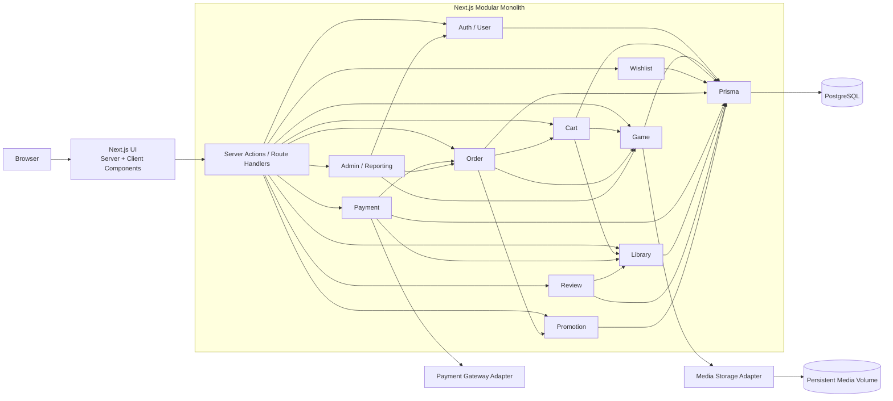

# Kế hoạch xây dựng hệ thống phân phối trò chơi điện tử trực tuyến

## 1. Mục đích tài liệu

Tài liệu này chuyển nội dung của báo cáo project **“Xây dựng hệ thống cửa hàng phân phối trò chơi điện tử trực tuyến”** thành kế hoạch triển khai phần mềm có thể thực thi.

Nguồn yêu cầu chính: [B22DCCN485 - Duong Phan Bao Linh - BaoCao Project](https://docs.google.com/document/d/14qqIExKfni39iZTHKTLaKrr4mzjhbgAqWB79l07F3Xk/edit).

Hiện trạng repository: mới có `README.md`, chưa có mã nguồn hoặc hạ tầng. Vì vậy, kế hoạch bắt đầu từ trạng thái greenfield và ưu tiên tạo một MVP chạy được theo từng vòng lặp.

Mục tiêu cuối cùng là một ứng dụng web Next.js dạng Modular Monolith, dùng Prisma và PostgreSQL, đáp ứng đầy đủ luồng mua trò chơi:

`User → Cart → Order → Payment → Library Item`

## 2. Phạm vi sản phẩm

### 2.1. Actor

- **Guest:** xem cửa hàng, tìm kiếm, lọc, xem chi tiết trò chơi, đăng ký và đăng nhập.
- **Customer:** sử dụng toàn bộ chức năng của Guest; quản lý hồ sơ, giỏ hàng, wishlist, thanh toán, lịch sử đơn hàng, thư viện và đánh giá.
- **Administrator:** quản lý người dùng, trò chơi, thể loại, nhà phát triển, nhà phát hành, media, khuyến mãi, đơn hàng, đánh giá và dashboard thống kê.
- **Payment Gateway:** thành phần ngoài hệ thống, được che chắn bởi một adapter. MVP dùng gateway giả lập nhưng giữ hợp đồng để có thể thay bằng cổng thật.

### 2.2. Chức năng trong MVP

1. Tài khoản:
   - đăng ký, đăng nhập, đăng xuất;
   - cập nhật hồ sơ, đổi mật khẩu;
   - tạo và sử dụng token khôi phục mật khẩu;
   - khóa/mở khóa tài khoản bởi Administrator;
   - phân quyền Guest, Customer và Administrator.
2. Cửa hàng trò chơi:
   - trang chủ và danh sách trò chơi;
   - tìm kiếm, lọc, sắp xếp, phân trang;
   - trang chi tiết, media, thể loại, nhà phát triển, nhà phát hành;
   - giá gốc, khuyến mãi đang hiệu lực và giá hiện tại.
3. Giỏ hàng và wishlist:
   - thêm, xóa và xem danh sách;
   - chặn dữ liệu trùng;
   - chặn thêm trò chơi đã sở hữu hoặc không còn được bán;
   - tính lại giá ở server.
4. Đơn hàng và thanh toán:
   - tạo Order và Order Item theo snapshot tại thời điểm mua;
   - tạo và xử lý Payment;
   - hỗ trợ kết quả thành công/thất bại;
   - xử lý callback idempotent;
   - chỉ cấp quyền sở hữu sau khi thanh toán thành công.
5. Thư viện:
   - hiển thị trò chơi đã mua;
   - hiển thị ngày mua và Order liên quan;
   - không cho người dùng tự xóa quyền sở hữu.
6. Đánh giá:
   - Customer đã sở hữu trò chơi được tạo, sửa, xóa một đánh giá;
   - đánh dấu đề xuất/không đề xuất;
   - Administrator có thể ẩn/hiện đánh giá.
7. Khuyến mãi:
   - tạo, sửa, ngừng chương trình;
   - gán trò chơi;
   - xác định thời gian và phần trăm giảm;
   - tính giá hiện hành mà không ghi đè giá gốc.
8. Quản trị và thống kê:
   - CRUD dữ liệu danh mục và trò chơi;
   - quản lý media thông qua storage service;
   - quản lý tài khoản, đơn hàng và đánh giá;
   - thống kê người dùng, đơn hàng, doanh thu, giao dịch và trò chơi bán chạy.

### 2.3. Ngoài phạm vi MVP

- Tải xuống hoặc cài đặt trò chơi thực tế.
- Cloud save, achievements và xác minh bản quyền phía máy khách.
- Bạn bè, nhắn tin, voice chat hoặc phát trực tiếp gameplay.
- Workshop, marketplace vật phẩm và hệ thống chống gian lận.
- Quản lý game server.
- Hoàn tiền, chargeback và nhiều lần thanh toán cho cùng một Order.
- Recommendation cá nhân hóa, mã coupon và hệ thống điểm thưởng.
- Microservices, event broker hoặc hạ tầng phân tán.

### 2.4. Definition of Done cấp sản phẩm

Sản phẩm được coi là hoàn thành khi:

- các luồng Guest, Customer và Administrator chạy được từ giao diện đến PostgreSQL;
- tất cả quy tắc nghiệp vụ bắt buộc được kiểm tra ở server;
- luồng thanh toán thành công tạo chính xác Order, Payment và Library Item;
- thanh toán thất bại không tạo Library Item;
- không xuất hiện dữ liệu trùng theo các ràng buộc nghiệp vụ;
- migration và seed chạy được trên database mới;
- lint, type-check, unit test, integration test, E2E test và production build đều đạt;
- ứng dụng chạy được bằng hướng dẫn trong `README.md`;
- môi trường triển khai có PostgreSQL và media volume bền vững;
- kết quả kiểm thử thực tế và ảnh demo được cập nhật vào báo cáo, không dùng số liệu giả định.

## 3. Quyết định kiến trúc

| Chủ đề | Quyết định |
|---|---|
| Kiến trúc | Một ứng dụng Next.js duy nhất, tổ chức theo Modular Monolith. |
| Ngôn ngữ | TypeScript với chế độ strict. |
| UI/server | Ưu tiên Server Components cho đọc dữ liệu; chỉ dùng Client Components cho phần cần state và tương tác trình duyệt. |
| Điểm vào nghiệp vụ | Server Actions cho form/mutation nội bộ; Route Handlers cho callback thanh toán, media và health check. Cả hai chỉ là adapter mỏng gọi application service. |
| Cơ sở dữ liệu | PostgreSQL; Prisma quản lý schema, migration và truy cập dữ liệu. |
| Ranh giới bảo mật | Client không import Prisma, không đọc secret, không tự quyết định giá, quyền sở hữu hoặc quyền quản trị. |
| Xác thực | Session được xác minh ở server; mật khẩu lưu dưới dạng hash an toàn; mọi mutation bảo vệ phải kiểm tra user và role. |
| Thanh toán | `PaymentGateway` interface với `MockPaymentGateway` cho MVP. Callback dùng cùng một luồng idempotent như gateway thật. |
| Media | `MediaStorage` interface với local filesystem adapter; metadata nằm trong PostgreSQL, file nằm trên persistent volume. |
| Tiền tệ | MVP dùng một đơn vị tiền tệ cấu hình được, mặc định `VND`; mọi giá dùng Decimal, không dùng số thực nhị phân. |
| Đánh giá | MVP dùng `isRecommended: boolean` và tỷ lệ đề xuất. Không thêm đánh giá sao vì báo cáo chưa xác định thuộc tính điểm số. |
| Xung đột khuyến mãi | Áp dụng một khuyến mãi có phần trăm giảm cao nhất; nếu bằng nhau, ưu tiên thời điểm bắt đầu sớm hơn rồi đến ID nhỏ hơn để kết quả luôn xác định. |
| Trò chơi miễn phí | Order có tổng tiền bằng 0 được hoàn tất qua payment adapter nội bộ, vẫn tạo Payment giá trị 0 để giữ một luồng dữ liệu thống nhất. |

Không khóa plan vào số phiên bản package cụ thể. Khi khởi tạo, chọn các bản stable tương thích, ghi chúng vào lockfile và chỉ nâng phiên bản qua pull request riêng.

## 4. Kiến trúc mục tiêu



### 4.1. Nguyên tắc module

- Mỗi module sở hữu use case, validation, repository interface và logic nghiệp vụ của miền đó.
- Module khác chỉ gọi API/service công khai; không import repository nội bộ của nhau.
- Prisma model là mô hình lưu trữ, không thay thế application service.
- Thành phần `server-only` phải được đánh dấu và đặt ngoài đường import của Client Components.
- Transaction nhiều module được điều phối tại application service sở hữu use case, đặc biệt là checkout và xử lý payment result.
- UI validation chỉ cải thiện trải nghiệm; server luôn validate lại bằng cùng schema hoặc schema tương đương.

### 4.2. Cấu trúc thư mục dự kiến

```text
game-distribution-system/
├─ docs/
│  ├─ build-plan.md
│  ├─ adr/
│  └─ test-results/
├─ prisma/
│  ├─ schema.prisma
│  ├─ migrations/
│  └─ seed.ts
├─ public/
│  └─ static/
├─ storage/
│  └─ media/                 # local development; không commit file upload
├─ src/
│  ├─ app/
│  │  ├─ (store)/
│  │  ├─ (account)/
│  │  ├─ admin/
│  │  └─ api/
│  ├─ modules/
│  │  ├─ auth/
│  │  ├─ user/
│  │  ├─ game/
│  │  ├─ cart/
│  │  ├─ wishlist/
│  │  ├─ order/
│  │  ├─ payment/
│  │  ├─ library/
│  │  ├─ review/
│  │  ├─ promotion/
│  │  └─ admin/
│  ├─ infrastructure/
│  │  ├─ database/
│  │  ├─ payment/
│  │  ├─ storage/
│  │  ├─ auth/
│  │  └─ logging/
│  ├─ shared/
│  │  ├─ ui/
│  │  ├─ validation/
│  │  ├─ errors/
│  │  └─ utils/
│  └─ tests/
├─ e2e/
├─ compose.yaml
├─ .env.example
└─ README.md
```

Một module nên có cấu trúc gần như sau:

```text
src/modules/cart/
├─ application/
│  ├─ cart.service.ts
│  └─ cart.dto.ts
├─ domain/
│  ├─ cart.errors.ts
│  └─ cart.rules.ts
├─ infrastructure/
│  └─ prisma-cart.repository.ts
├─ presentation/
│  ├─ cart.actions.ts
│  └─ components/
└─ index.ts                    # public API của module
```

## 5. Mô hình dữ liệu

### 5.1. Bảng nghiệp vụ chính

| Bảng | Thuộc tính chính | Ràng buộc quan trọng |
|---|---|---|
| `User` | username, email, passwordHash, displayName, avatarPath, birthDate, countryCode, role, status, timestamps | username và email unique; role enum; user bị khóa không tạo session mới |
| `Developer` | name, description, website, logoPath, countryCode | name được index; không xóa cứng khi còn Game tham chiếu |
| `Publisher` | name, description, website, logoPath, countryCode | tương tự Developer |
| `Category` | name, slug, description, isActive | name và slug unique |
| `Game` | name, slug, shortDescription, description, basePrice, releaseDate, coverPath, heroPath, ageRating, status, platforms, minimumRequirements, recommendedRequirements, developerId, publisherId, timestamps | slug unique; basePrice >= 0; index status/releaseDate/name |
| `GameCategory` | gameId, categoryId | composite unique `(gameId, categoryId)` |
| `GameMedia` | gameId, type, path, previewPath, title, sortOrder, metadata | index `(gameId, sortOrder)`; path do storage adapter tạo |
| `Cart` | userId, status, timestamps | mỗi user chỉ có một Cart ACTIVE; nếu dùng partial unique index thì thêm bằng migration SQL |
| `CartItem` | cartId, gameId, priceWhenAdded, addedAt | composite unique `(cartId, gameId)` |
| `Wishlist` | userId, timestamps | userId unique |
| `WishlistItem` | wishlistId, gameId, addedAt | composite unique `(wishlistId, gameId)` |
| `Order` | userId, subtotal, discountTotal, grandTotal, currency, status, createdAt, paidAt | grandTotal >= 0; index userId/createdAt/status |
| `OrderItem` | orderId, gameId, gameNameSnapshot, basePriceSnapshot, discountSnapshot, paidPrice | snapshot không thay đổi khi Game hoặc Promotion thay đổi |
| `Payment` | orderId, method, provider, providerTransactionId, amount, status, processedAt, failureReason, idempotencyKey | orderId unique trong MVP; providerTransactionId và idempotencyKey unique khi có giá trị |
| `LibraryItem` | userId, gameId, orderItemId, purchasedAt, ownershipStatus | composite unique `(userId, gameId)`; orderItemId unique |
| `Review` | userId, gameId, content, isRecommended, visibilityStatus, timestamps | composite unique `(userId, gameId)` |
| `Promotion` | name, description, discountPercent, startsAt, endsAt, status, createdById | `0 < discountPercent <= 100`; endsAt > startsAt |
| `GamePromotion` | gameId, promotionId, createdAt | composite unique `(gameId, promotionId)` |

### 5.2. Bảng hỗ trợ

- `Session` hoặc bảng tương đương nếu thư viện auth dùng database session.
- `PasswordResetToken` với token hash, userId, expiresAt và usedAt.
- `AuditLog` cho thao tác quản trị nhạy cảm: khóa tài khoản, đổi trạng thái Game, ẩn Review và thay đổi Promotion.

### 5.3. Enum tối thiểu

- `UserRole`: `CUSTOMER`, `ADMIN`.
- `UserStatus`: `ACTIVE`, `LOCKED`.
- `GameStatus`: `DRAFT`, `PUBLISHED`, `HIDDEN`, `ARCHIVED`.
- `CartStatus`: `ACTIVE`, `CHECKED_OUT`, `ABANDONED`.
- `OrderStatus`: `PENDING_PAYMENT`, `PAID`, `PAYMENT_FAILED`, `CANCELLED`.
- `PaymentStatus`: `PENDING`, `SUCCEEDED`, `FAILED`.
- `ReviewVisibility`: `VISIBLE`, `HIDDEN`.
- `PromotionStatus`: `DRAFT`, `ACTIVE`, `STOPPED`.
- `MediaType`: `IMAGE`, `VIDEO`.

Promotion có hiệu lực chỉ khi trạng thái là `ACTIVE` và thời gian hiện tại nằm trong `[startsAt, endsAt]`. Không cần job đổi trạng thái sang “expired”; trạng thái hiệu lực được tính từ dữ liệu.

## 6. Quy tắc nghiệp vụ bắt buộc

### 6.1. Tài khoản và phân quyền

- Username và email không trùng, email được chuẩn hóa trước khi kiểm tra.
- User bị khóa không đăng nhập và session hiện có phải bị vô hiệu hóa.
- Customer chỉ sửa hồ sơ, mật khẩu, giỏ hàng, wishlist, review và dữ liệu thuộc chính mình.
- Mọi route/action `/admin` kiểm tra role ở server; ẩn menu ở client không phải biện pháp bảo mật.

### 6.2. Cửa hàng, cart và wishlist

- Chỉ Game `PUBLISHED` xuất hiện ở storefront và được thêm mới vào Cart.
- Game đã mua vẫn hiển thị trong Library ngay cả khi chuyển sang `HIDDEN` hoặc `ARCHIVED`.
- Một Game chỉ xuất hiện một lần trong Cart và Wishlist.
- Không thêm Game đã sở hữu vào Cart.
- Giá hiển thị từ client không được dùng để tạo Order.
- Khi checkout, server tính lại khuyến mãi và giá. Nếu khác giá người dùng vừa thấy, trả kết quả `PRICE_CHANGED` để giao diện hiển thị giá mới và yêu cầu xác nhận lại.

### 6.3. Checkout, payment và library

Luồng triển khai chuẩn:

1. Khóa logic checkout của Cart để chống gửi lặp.
2. Đọc lại Cart, Game, quyền sở hữu và Promotion từ database.
3. Tính lại subtotal, discount và grand total bằng Decimal.
4. Trong transaction, tạo Order, Order Item snapshot và Payment `PENDING`.
5. Gọi payment adapter ngoài database transaction.
6. Xử lý kết quả/callback bằng `idempotencyKey`.
7. Khi thành công, trong một transaction cục bộ:
   - chuyển Payment sang `SUCCEEDED`;
   - chuyển Order sang `PAID`;
   - tạo các Library Item bằng thao tác không tạo trùng;
   - xóa các Cart Item đã mua hoặc đóng Cart;
   - ghi thời gian thanh toán.
8. Khi thất bại, chuyển Payment và Order sang trạng thái thất bại; không tạo Library Item.

Không giữ database transaction trong lúc chờ gateway bên ngoài. Callback lặp lại phải trả thành công mà không tạo thêm Library Item.

### 6.4. Review

- Chỉ Customer sở hữu Game mới được tạo Review.
- Một user chỉ có một Review cho một Game.
- User chỉ sửa/xóa Review của mình.
- Review `HIDDEN` không xuất hiện công khai nhưng vẫn tồn tại để kiểm duyệt.
- Điểm tổng hợp của Game là tỷ lệ `isRecommended = true` trên các Review đang hiển thị.

### 6.5. Promotion

- `endsAt` phải sau `startsAt`.
- `discountPercent` lớn hơn 0 và không quá 100.
- Giá sau giảm không âm và được làm tròn theo quy tắc tiền tệ đã chọn.
- Chỉ một Promotion được áp dụng cho mỗi Game tại một thời điểm theo quy tắc ưu tiên ở mục 3.
- Order Item luôn lưu snapshot giá và giảm giá, không phụ thuộc Promotion sau khi Order được tạo.

### 6.6. Media

- Chỉ chấp nhận MIME type, phần mở rộng và kích thước nằm trong allowlist cấu hình.
- Tên file do server sinh; không dùng trực tiếp tên file từ người dùng.
- Đường dẫn đã chuẩn hóa phải nằm bên trong `MEDIA_ROOT`.
- Upload theo thứ tự: validate → ghi file tạm → ghi metadata/quan hệ → chuyển file vào vị trí chính thức.
- Nếu ghi database thất bại, xóa file mới; nếu xóa database entity, chỉ xóa file sau khi đã xác định không còn tham chiếu.

## 7. Bề mặt giao diện

### 7.1. Storefront và tài khoản

| Route | Actor | Nội dung |
|---|---|---|
| `/` | Guest+ | trang chủ, game nổi bật, game mới, promotion đang chạy |
| `/games` | Guest+ | tìm kiếm, lọc category/platform/giá, sắp xếp, phân trang |
| `/games/[slug]` | Guest+ | thông tin, media, giá, promotion, review và nút Cart/Wishlist |
| `/login`, `/register` | Guest | xác thực |
| `/forgot-password`, `/reset-password` | Guest | khôi phục mật khẩu bằng token |
| `/cart` | Customer | danh sách, giá hiện tại, cảnh báo item không hợp lệ |
| `/checkout` | Customer | xác nhận Order và phương thức thanh toán |
| `/checkout/result` | Customer | kết quả thanh toán, chống refresh tạo giao dịch lặp |
| `/wishlist` | Customer | game đang quan tâm |
| `/library` | Customer | game đã sở hữu |
| `/orders`, `/orders/[id]` | Customer | lịch sử và chi tiết Order thuộc user |
| `/profile`, `/profile/security` | Customer | hồ sơ và đổi mật khẩu |

### 7.2. Quản trị

| Route | Nội dung |
|---|---|
| `/admin` | dashboard tổng quan |
| `/admin/games` | tìm kiếm, tạo, sửa, ẩn, quản lý media và category |
| `/admin/categories` | CRUD category |
| `/admin/developers` | CRUD developer |
| `/admin/publishers` | CRUD publisher |
| `/admin/promotions` | CRUD promotion và gán game |
| `/admin/users` | danh sách, chi tiết, khóa/mở khóa |
| `/admin/orders` | danh sách, lọc và xem Order/Payment |
| `/admin/reviews` | kiểm duyệt ẩn/hiện |
| `/admin/reports` | doanh thu, đơn hàng, giao dịch và game bán chạy |

Mọi danh sách lớn phải phân trang ở server, đồng thời giữ filter/sort trong URL để có thể tải lại và chia sẻ trạng thái trang.

## 8. Hợp đồng ứng dụng và điểm vào server

### 8.1. Server Actions

- Auth: đăng ký, đăng nhập, đăng xuất, đổi mật khẩu, yêu cầu/reset mật khẩu.
- User: cập nhật hồ sơ.
- Cart: thêm game, xóa item, làm mới giá.
- Wishlist: thêm và xóa game.
- Checkout: chuẩn bị quote, xác nhận tạo Order, bắt đầu Payment.
- Review: tạo, sửa, xóa.
- Admin: mutation cho game, category, developer, publisher, promotion, user và review.

Server Action chỉ làm bốn việc: xác thực request, parse input, gọi application service và ánh xạ kết quả/lỗi cho UI.

### 8.2. Route Handlers

- `POST /api/payments/mock/complete`: giả lập kết quả payment trong môi trường local/test.
- `POST /api/payments/callback`: callback chuẩn hóa cho gateway; xác minh chữ ký khi dùng provider thật.
- `POST /api/media`: upload media có auth và validation.
- `GET /api/media/[...path]`: chỉ cần nếu media không được phục vụ trực tiếp từ reverse proxy/static volume.
- `GET /api/health/live`: tiến trình còn sống.
- `GET /api/health/ready`: kiểm tra kết nối database và storage cần thiết.

### 8.3. Chuẩn lỗi

Application service trả lỗi có mã ổn định, ví dụ:

- `AUTH_REQUIRED`, `FORBIDDEN`, `ACCOUNT_LOCKED`;
- `GAME_NOT_FOUND`, `GAME_NOT_AVAILABLE`;
- `GAME_ALREADY_OWNED`, `CART_ITEM_EXISTS`, `CART_EMPTY`;
- `PRICE_CHANGED`, `PROMOTION_INVALID`;
- `ORDER_NOT_FOUND`, `PAYMENT_AMOUNT_MISMATCH`, `PAYMENT_ALREADY_PROCESSED`;
- `REVIEW_OWNERSHIP_REQUIRED`, `REVIEW_ALREADY_EXISTS`;
- `MEDIA_TYPE_NOT_ALLOWED`, `MEDIA_TOO_LARGE`.

Không gửi stack trace, Prisma error hoặc thông tin secret về client.

## 9. Kế hoạch triển khai 8 tuần

Mỗi tuần là một vòng lặp có demo, test và migration riêng. Không chuyển sang vòng tiếp theo khi tiêu chí nghiệm thu của critical path chưa đạt.

### Tuần 1 — Nền tảng và ranh giới kiến trúc

Mục tiêu: ứng dụng Next.js chạy được, có database local và cấu trúc module chuẩn.

Công việc:

- khởi tạo Next.js + TypeScript strict, formatter, lint và test runner;
- tạo cấu trúc `src/app`, `src/modules`, `src/infrastructure`, `src/shared`;
- cấu hình import alias và kiểm tra cấm Prisma trong client bundle;
- tạo PostgreSQL bằng Compose, Prisma client và migration đầu tiên;
- tạo `.env.example`, validation biến môi trường và logger;
- tạo layout storefront/admin, error boundary, not-found và loading state;
- tạo CI tối thiểu: install → lint → type-check → test → build;
- ghi ADR cho Modular Monolith, payment adapter và media storage.

Đầu ra:

- ứng dụng và database khởi động bằng một quy trình được ghi trong README;
- `/api/health/live` và `/api/health/ready` hoạt động;
- CI chạy xanh trên mã nền.

Tiêu chí nghiệm thu:

- database mới có thể migrate từ đầu;
- production build thành công;
- một Client Component thử nghiệm không thể import database module.

### Tuần 2 — Mô hình dữ liệu, Auth và User

Mục tiêu: Customer/Admin có thể xác thực và quyền được kiểm tra ở server.

Công việc:

- triển khai schema cho User, session và password reset;
- tạo migration, factory và seed hai Admin cùng tài khoản mẫu;
- đăng ký với username/email unique và password policy;
- đăng nhập, đăng xuất, session, middleware điều hướng và server guard;
- khóa user, từ chối đăng nhập và thu hồi session;
- hồ sơ, avatar metadata, đổi mật khẩu và reset token;
- unit test auth service và integration test ràng buộc unique/lock.

Đầu ra:

- các trang auth/profile hoạt động;
- server guard `requireUser` và `requireAdmin` được dùng thống nhất.

Tiêu chí nghiệm thu:

- đăng nhập đúng thành công; sai mật khẩu hoặc user bị khóa bị từ chối;
- Customer gọi mutation Admin nhận `FORBIDDEN` ở server;
- token reset hết hạn hoặc đã dùng không thể dùng lại.

### Tuần 3 — Catalog, tìm kiếm và storefront

Mục tiêu: Guest duyệt và tìm trò chơi bằng dữ liệu thật trong PostgreSQL.

Công việc:

- triển khai Developer, Publisher, Category, Game, GameCategory và GameMedia;
- tạo seed 30–50 Game, 8–12 Category, khoảng 10 Developer và 10 Publisher;
- xây admin CRUD cơ bản cho dữ liệu catalog;
- xây trang chủ, danh sách và chi tiết Game;
- tìm kiếm không phân biệt hoa thường, filter, sort và phân trang;
- index các cột truy vấn chính và tránh N+1;
- hiển thị trạng thái empty/loading/error và giao diện responsive cơ bản.

Đầu ra:

- luồng `/ → /games → /games/[slug]` hoàn chỉnh;
- Admin tạo/sửa/ẩn Game và thay đổi được phản ánh ở storefront.

Tiêu chí nghiệm thu:

- Game không `PUBLISHED` không xuất hiện công khai;
- slug, filter và pagination ổn định khi reload;
- truy vấn danh sách không tải media hoặc mô tả dài không cần thiết.

### Tuần 4 — Cart, Wishlist, Order draft và checkout quote

Mục tiêu: Customer chuẩn bị được một giao dịch hợp lệ, chưa cần cấp quyền sở hữu.

Công việc:

- triển khai Cart, CartItem, Wishlist và WishlistItem;
- thêm/xóa item, unique constraint và ownership check;
- triển khai Promotion và GamePromotion đủ để tính giá hiện tại;
- xây pricing service dùng Decimal và quy tắc chọn promotion;
- tạo checkout quote từ dữ liệu server;
- triển khai Order/OrderItem snapshot ở trạng thái `PENDING_PAYMENT`;
- chống double-submit bằng idempotency key và trạng thái Cart/Order;
- integration test Cart → Pricing → Order.

Đầu ra:

- Cart, Wishlist và Checkout UI chạy được;
- Order pending được tạo với snapshot giá đúng.

Tiêu chí nghiệm thu:

- không thêm được Game trùng hoặc đã sở hữu;
- Cart rỗng không checkout;
- thay đổi giá tạo `PRICE_CHANGED`, không âm thầm dùng giá từ client;
- tổng Order bằng tổng Order Item sau giảm giá.

### Tuần 5 — Payment, Library, Review và media

Mục tiêu: hoàn tất luồng mua game từ đầu đến cuối.

Công việc:

- định nghĩa `PaymentGateway` và triển khai `MockPaymentGateway`;
- xử lý success/failure/callback lặp lại;
- transaction cập nhật Payment, Order, Library Item và Cart;
- triển khai Library UI và kiểm tra quyền sở hữu;
- triển khai Review create/update/delete và kiểm duyệt hiển thị;
- định nghĩa `MediaStorage`, local adapter, upload validation và cleanup;
- test lỗi transaction và file mồ côi;
- E2E cho happy path và payment failure.

Đầu ra:

- mua game thành công xuất hiện trong Library;
- payment thất bại giữ Library không đổi;
- user đã mua có thể tạo đúng một Review.

Tiêu chí nghiệm thu:

- callback xử lý hai lần chỉ tạo một quyền sở hữu;
- amount Payment khớp grand total;
- Review của người chưa sở hữu bị từ chối ở server;
- upload sai loại hoặc quá kích thước không tạo file/metadata.

### Tuần 6 — Promotion hoàn chỉnh, Admin và reporting

Mục tiêu: Administrator vận hành được toàn bộ dữ liệu MVP.

Công việc:

- hoàn thiện lịch, trạng thái và gán Game cho Promotion;
- hoàn thiện quản lý user, game, category, developer, publisher và media;
- quản lý Order/Payment ở chế độ đọc và lọc;
- ẩn/hiện Review, ghi AuditLog cho thao tác nhạy cảm;
- dashboard số user, số Order, doanh thu, trạng thái giao dịch và top Game;
- kiểm tra timezone và ranh giới bắt đầu/kết thúc promotion;
- tối ưu index và query aggregate.

Đầu ra:

- toàn bộ màn hình Admin trong mục 7.2 hoạt động;
- dashboard dùng dữ liệu thật, có filter thời gian.

Tiêu chí nghiệm thu:

- Customer không đọc hoặc mutate dữ liệu Admin;
- promotion hết hạn không còn làm giảm giá;
- số liệu doanh thu chỉ tính Order `PAID` và không bị nhân bản bởi join.

### Tuần 7 — Kiểm thử, bảo mật và ổn định

Mục tiêu: chứng minh hệ thống đúng nghiệp vụ và đủ ổn định để demo.

Công việc:

- hoàn thiện unit, integration và E2E suite;
- chạy bộ dữ liệu biên/lỗi trong mục 10;
- rà CSRF theo cơ chế auth/action đang dùng, XSS, upload path traversal và access control;
- rate limit đăng nhập, reset password, payment callback và upload;
- kiểm tra lỗi concurrent checkout, duplicate callback và update promotion đồng thời;
- kiểm tra accessibility cơ bản, responsive và keyboard flow;
- đo các trang/truy vấn chính, sửa N+1 và thêm index có bằng chứng;
- chạy production build bằng cấu hình gần môi trường triển khai.

Đầu ra:

- test report có Pass/Fail thực tế;
- không còn lỗi blocker hoặc high-severity đã biết.

Tiêu chí nghiệm thu:

- toàn bộ quality gate đạt;
- 12 ca kiểm thử trọng tâm trong báo cáo đạt;
- dữ liệu vẫn nhất quán sau test retry, lỗi payment và lỗi transaction.

### Tuần 8 — Triển khai, tài liệu và demo

Mục tiêu: có bản chạy ổn định, quy trình cài đặt lặp lại được và bằng chứng cho báo cáo.

Công việc:

- tạo cấu hình production, migration deploy và persistent media volume;
- cấu hình HTTPS/reverse proxy ở môi trường triển khai;
- tạo tài khoản demo và seed dữ liệu trình bày;
- kiểm tra backup/restore PostgreSQL và media;
- hoàn thiện README, sơ đồ kiến trúc, ERD và hướng dẫn Admin;
- chụp ảnh giao diện, lưu kết quả test và cập nhật báo cáo;
- chuẩn bị kịch bản demo happy path và phương án demo offline;
- gắn release tag sau khi smoke test môi trường triển khai.

Đầu ra:

- URL hoặc môi trường demo hoạt động;
- bộ tài liệu đủ để cài đặt, vận hành và trình bày project.

Tiêu chí nghiệm thu:

- deploy từ database sạch thành công;
- smoke test Guest → Customer → Payment → Library → Review đạt;
- restart ứng dụng không làm mất media hoặc dữ liệu database.

## 10. Chiến lược kiểm thử

### 10.1. Các tầng kiểm thử

- **Unit:** pricing, promotion selection, state transition, password policy, ownership rule và error mapping.
- **Integration:** application service với PostgreSQL test; kiểm tra transaction, unique constraint và query aggregate.
- **Contract:** `PaymentGateway` và `MediaStorage` dùng chung một contract test cho adapter giả lập/thật.
- **E2E:** chạy từ trình duyệt qua UI và server tới database cho các luồng quan trọng.
- **Smoke:** health, login, catalog, checkout, payment success và library trên môi trường deploy.

### 10.2. Dữ liệu kiểm thử

- 10–20 Customer và 2 Admin.
- 30–50 Game, gồm Game miễn phí, Game bị ẩn và Game đã archive.
- 8–12 Category; khoảng 10 Developer và 10 Publisher.
- 5–10 Promotion: chưa bắt đầu, đang chạy, hết hạn, bị dừng và chồng lấn.
- Order/Payment ở mọi trạng thái.
- Dữ liệu lỗi: email/username trùng, giá âm, thời gian promotion sai, item trùng, Game đã sở hữu, callback lặp, file media không hợp lệ.

### 10.3. Ca kiểm thử bắt buộc

| ID | Ca kiểm thử | Kết quả mong đợi |
|---|---|---|
| TC-01 | Đăng nhập bằng tài khoản hợp lệ | tạo session và vào đúng trang |
| TC-02 | Đăng nhập bằng tài khoản bị khóa | bị từ chối |
| TC-03 | Thêm Game chưa sở hữu vào Cart | tạo một Cart Item |
| TC-04 | Thêm Game đã sở hữu vào Cart | bị từ chối |
| TC-05 | Thêm cùng Game hai lần | không tạo bản ghi trùng |
| TC-06 | Checkout sau khi giá thay đổi | server dùng giá mới và yêu cầu xác nhận lại |
| TC-07 | Payment thành công | Payment/Order thành công và tạo Library Item |
| TC-08 | Payment thất bại | không tạo Library Item |
| TC-09 | Review Game chưa sở hữu | bị từ chối |
| TC-10 | Tạo Review thứ hai cho cùng User/Game | bị từ chối |
| TC-11 | Customer gọi chức năng Admin | bị từ chối ở server |
| TC-12 | Upload media không hợp lệ | không lưu file và metadata |
| TC-13 | Gửi lại payment callback | không tạo dữ liệu trùng |
| TC-14 | Checkout đồng thời cùng Cart | tối đa một Order hợp lệ được tiếp tục |
| TC-15 | Transaction cấp Library thất bại | rollback trạng thái cục bộ, không có ownership dở dang |
| TC-16 | Promotion hết hạn đúng ranh giới thời gian | giá trở về đúng giá áp dụng còn hiệu lực |

### 10.4. Quality gate trước merge/release

- Formatter/lint không lỗi.
- TypeScript type-check không lỗi.
- Unit và integration test đạt.
- E2E critical path đạt.
- Prisma schema validate, migration từ database sạch và seed đạt.
- Production build đạt.
- Không commit secret, file upload, database dump hoặc dữ liệu cá nhân.

## 11. Bảo mật và tính nhất quán

- Hash mật khẩu bằng thuật toán phù hợp cho password hashing; không log password hoặc reset token thô.
- Reset token chỉ lưu hash, có hạn dùng và chỉ sử dụng một lần.
- Cookie session đặt `HttpOnly`, `Secure` trong production và `SameSite` phù hợp.
- Kiểm tra authorization tại application service, không chỉ tại route/layout.
- Validate tất cả input server-side; giới hạn độ dài text và kích thước request/upload.
- Escape/render review dưới dạng text; không cho HTML tùy ý.
- Dùng query tham số hóa thông qua Prisma; raw SQL chỉ dùng khi thật cần và phải được review.
- Không tin amount, price, discount, role, userId hoặc ownership do client gửi.
- Các state transition Order/Payment được kiểm tra rõ ràng; không cho chuyển ngược từ `PAID` sang pending.
- Idempotency key và unique constraint là lớp bảo vệ cuối cho request gửi lặp.
- Audit log không chứa secret nhưng phải ghi actor, action, target, thời gian và kết quả.

## 12. Hiệu năng và khả năng vận hành

- Phân trang mọi danh sách Game, User, Order và Review.
- Chỉ select trường cần thiết; không tải blob vì media không nằm trong PostgreSQL.
- Index theo truy vấn thực tế: Game status/slug/name, Order user/status/createdAt, Payment status, Promotion time/status và các foreign key.
- Cache chỉ áp dụng cho dữ liệu công khai; mutation catalog/promotion phải revalidate đúng phạm vi.
- Không cache Cart, Checkout, Order, Library hoặc dữ liệu riêng của user giữa các phiên.
- Log có request/correlation ID; payment callback và checkout phải log idempotency key đã làm mờ nếu cần.
- Readiness thất bại khi database hoặc storage bắt buộc không sẵn sàng.
- Dashboard thống kê dùng aggregate ở database, không tải toàn bộ Order về Node.js để tính.

## 13. Môi trường và triển khai

### 13.1. Biến môi trường dự kiến

```dotenv
DATABASE_URL=
AUTH_SECRET=
APP_URL=
MEDIA_ROOT=
MEDIA_MAX_BYTES=
PAYMENT_PROVIDER=mock
PAYMENT_CALLBACK_SECRET=
DEFAULT_CURRENCY=VND
SEED_ADMIN_EMAIL=
SEED_ADMIN_PASSWORD=
```

`.env.example` chỉ chứa tên biến và giá trị mẫu không nhạy cảm. Secret thật không được commit.

### 13.2. Local development

- Compose chạy PostgreSQL và volume database.
- Ứng dụng có thể chạy trên host để hot reload.
- Media local đặt trong thư mục gitignored hoặc named volume.
- Seed tạo dữ liệu demo xác định được và có thể chạy lặp an toàn trong môi trường development.

### 13.3. Production/demo

- Chạy Next.js bằng Node runtime phù hợp với Prisma và filesystem storage.
- PostgreSQL dùng volume/dịch vụ bền vững.
- Media dùng persistent volume và được backup cùng database.
- Chạy `prisma migrate deploy` trước khi chuyển traffic.
- Chỉ đánh dấu release thành công sau readiness và smoke test.
- Có rollback ứng dụng; migration phá hủy dữ liệu phải tách thành nhiều bước tương thích ngược.

## 14. Tài liệu cần duy trì trong quá trình xây dựng

- `README.md`: cài đặt, biến môi trường, migrate, seed, test, build và run.
- `docs/adr/`: quyết định kiến trúc và thay đổi quan trọng.
- ERD cập nhật theo `schema.prisma`.
- Sơ đồ module và luồng checkout/payment.
- Danh sách route/action công khai và mã lỗi nghiệp vụ.
- `docs/test-results/`: kết quả test thực tế theo mã ca kiểm thử.
- Hướng dẫn Admin và kịch bản demo.
- Báo cáo project: chỉ cập nhật kết quả, số liệu và ảnh sau khi đã chạy thực tế.

## 15. Rủi ro và phương án xử lý

| Rủi ro | Ảnh hưởng | Giảm thiểu |
|---|---|---|
| Phạm vi tăng trong lúc triển khai | trễ critical path | đóng scope MVP ở mục 2; yêu cầu mới đưa vào backlog sau MVP |
| Logic thanh toán và transaction sai | mất nhất quán Order/Library | dùng state machine, idempotency, transaction cục bộ và integration test lỗi |
| Adapter mock khác gateway thật | khó tích hợp sau này | contract test và callback chuẩn hóa ngay từ đầu |
| Media mất khi deploy/restart | mất ảnh game/avatar | persistent volume, backup và startup check `MEDIA_ROOT` |
| Truy cập chéo module tùy tiện | modular monolith biến thành codebase rối | public `index.ts`, import rule và architecture review |
| Report và implementation lệch nhau | demo/đánh giá không nhất quán | mỗi tuần đối chiếu backlog, schema, test và ảnh với báo cáo |
| Chồng lấn promotion gây giá không xác định | sai giá Order | quy tắc ưu tiên duy nhất và test ranh giới thời gian |
| Double-click/callback retry | tạo Order hoặc ownership trùng | idempotency key, unique constraint và test concurrent request |
| Upload file độc hại/path traversal | rủi ro bảo mật | allowlist, server-generated filename, size limit và path normalization |
| Dashboard chậm hoặc cộng sai | số liệu báo cáo sai | aggregate query, index và test dữ liệu có nhiều join |

## 16. Critical path và thứ tự ưu tiên

Critical path bắt buộc:

`Foundation → Auth/User → Game Catalog → Cart → Order → Payment → Library → Review → Integration/E2E → Deploy`

Các nhánh có thể làm song song sau khi Catalog ổn định:

- Wishlist có thể phát triển song song với Cart.
- Media có thể bắt đầu cùng Admin Game nhưng phải hoàn tất trước quản trị catalog đầy đủ.
- Promotion có thể phát triển song song với Order, nhưng pricing contract phải chốt trước checkout.
- Admin reporting chỉ bắt đầu sau khi Order/Payment có schema và dữ liệu ổn định.

Nếu thiếu thời gian, giữ nguyên critical path và giảm polish/dashboard nâng cao trước; không bỏ transaction, authorization, idempotency hoặc kiểm thử ownership.

## 17. Các mặc định cần đổi trước khi đưa vào production thật

Plan dùng các mặc định sau để MVP không bị chặn:

- payment gateway: mock;
- tiền tệ: VND;
- media: filesystem persistent volume;
- khôi phục mật khẩu trong local: trả link qua mail adapter development, không tích hợp nhà cung cấp email thật;
- Review: đề xuất/không đề xuất, không có điểm sao;
- một Payment cho mỗi Order, chưa có refund.

Trước production thật cần chốt provider thanh toán, email delivery, miền triển khai, chính sách dữ liệu cá nhân, thời gian lưu log, backup, giới hạn upload và quy trình xử lý giao dịch lỗi.
